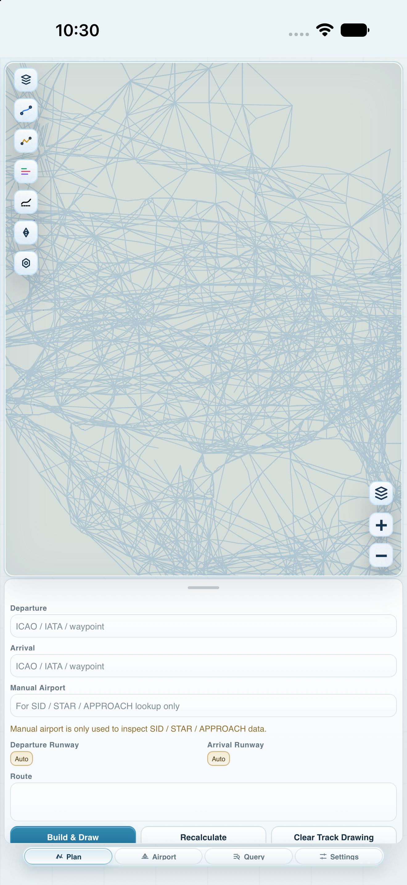
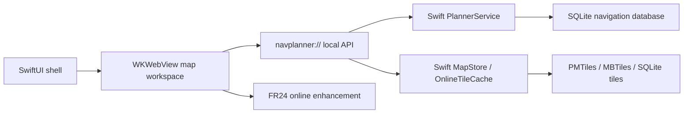

# NavPlanner

<p align="center">
  
</p>

<p align="center">
  An all-in-one sim-flight planning desk for iPhone and iPad.
  <br />
  <a href="README.zh-CN.md">简体中文</a>
</p>

<p align="center">
  
  &nbsp;&nbsp;
  
</p>

NavPlanner is a native iOS planning desk for flight simulation. It brings **route planning**, **airport and procedure inspection**, **offline maps**, **local navigation databases**, and optional **FR24 online track download, comparison, and matching** into one app, emphasizing **an integrated workflow from route idea to map review** and **offline availability**.

NavPlanner is built around a SwiftUI shell, a WKWebView map workspace, and a Swift service layer packaged inside the app. It is designed for simulator flying, study, and personal planning practice.

**Important safety notice:** NavPlanner is not certified aviation software. It is strictly prohibited to use NavPlanner for real-world flight planning, navigation, dispatch, operational decision-making, or any safety-critical aviation activity.

## Highlights

- **Local route planning**: enter departure and arrival airports, build and draw a route, leave Route blank for full auto-planning, or insert `***` between fixes to auto-plan one segment.
- **Procedure preview**: browse and draw `SID`, `STAR`, and `APPROACH` procedures by runway, including RF / AF arcs, missed approach segments, and holding geometry.
- **Map overlays and drawing control**: toggle base maps, planned routes, manual routes, procedure paths, FR24 tracks, terminal waypoints, other fixes, navaids, runways, ILS, and airway labels; undo, redo, or clear drawn tracks from the map.
- **Airport workspace**: inspect runways, frequencies, procedures, and map popovers; quickly assign airports from the map to departure, arrival, or manual slots.
- **Flight calculation workspace**: choose aircraft type, cruise altitude, cruise Mach, descent rate, and weather source; review route wind / terrain and ground speed / VS profiles; estimate fuel in a SimBrief-style format.
- **FR24 track comparison**: after syncing an in-app browser session, query recent flights or a specific flightId, view history, download or manually import GPX tracks, inspect altitude / speed profiles, and match tracks back to local route data.
- **Offline maps**: import or download PMTiles, MBTiles, SQLite tile stores, and legacy Web `tiles/` layouts; manage storage, active resources, download progress, and online tile cache separately.
- **Local navigation databases**: import `.s3db`, `.sqlite`, `.sqlite3`, or `.db` files from Files, switch between local databases, remove unused copies, and restore the bundled database.

## Using NavPlanner

### Plan and draw a route

1. Open the **Plan** tab.
2. Enter departure and arrival airports, for example `KLAX` and `KJFK`.
3. Pick runways or keep them on automatic selection.
4. Enter a route string, leave it blank for auto-planning, or use `***` between fixes to auto-plan a segment.
5. Tap **Generate & Draw Route**.

`DCT`, `SID`, `STAR`, `APPROACH`, airway names, fix identifiers, `AIRAC`, `PMTiles`, `MBTiles`, and `SQLite` remain in English regardless of the selected UI language.

### Inspect airports and procedures

1. Enter a manual airport in Plan, or tap an airport on the map.
2. Open the **Airport** tab.
3. Switch between departure, arrival, and manual slots.
4. Review runways, communication frequencies, and procedure lists.
5. Tap a procedure to preview it on the map.

### Calculate profiles and fuel

1. Build a route in **Plan** and select any required `SID`, `STAR`, or `APPROACH`.
2. Open the **Calc** tab.
3. Select manufacturer and aircraft type, then adjust cruise altitude, cruise Mach, descent rate, and weather source.
4. Review the route wind / terrain profile, drag planned altitude segments when needed, and check the ground speed / VS profile.
5. Review the SimBrief-style fuel estimate.

The current calculation model is local-first and works offline. Real NOAA / ECMWF / GFS weather grids, DEM terrain sampling, and fuller aircraft performance libraries are planned enhancements; the app keeps a local estimate when those sources are unavailable.

### Query and draw FR24 tracks

1. Fill departure and arrival airports in Plan.
2. Open the **Query** tab.
3. For the first query, open the verification page in the in-app browser, complete the FR24 / Cloudflare check, then sync the browser session.
4. Tap **Query** to list up to 10 recent flights for the route, or search a flight number / flightId manually.
5. Download and draw a flight track, manually import a GPX file, review the altitude / speed profile, or match the track against the local route engine.

Downloaded FR24 tracks are cached locally with GPX, playback JSON, and metadata. The Query tab can search the cache, draw cached tracks, share GPX files, favorite important tracks, open the cache folder, and clear non-favorited downloads.

FR24 is an online enhancement. When the network is unavailable, the browser session expires, or FR24 returns a verification page, local planning, airport lookup, procedures, nav overlays, and offline maps remain available. NavPlanner reuses only the browser session that the user completes inside the app; it does not bypass Cloudflare or automate CAPTCHA challenges.

### Manage offline maps

1. Open **Settings**.
2. Choose **Manage Offline Maps**.
3. Import or download PMTiles, MBTiles, or SQLite tile resources.
4. Select an active resource to make the map prefer local tiles.

Online map cache and offline map packages are managed separately. Clearing the online cache does not remove imported offline maps or navigation databases.

### Import navigation databases

1. Open **Settings**.
2. In **Navigation Database**, tap **Choose s3db**.
3. Pick a `.s3db`, `.sqlite`, `.sqlite3`, or `.db` file from Files.
4. NavPlanner switches to the imported database and refreshes route, procedure, and nav-overlay caches.

## Architecture



User data stays in the app sandbox: imported navigation databases, offline map packages, FR24 track cache, online tile cache, appearance settings, and browser-session configuration are stored locally.

## Build From Source

### Requirements

- macOS with Xcode.
- iOS 17.0 or later deployment target.
- iPhone / iPad Simulator or a physical device.
- Optional: a local navigation database. Public repositories should not include copyrighted navigation data; for private builds, place a database at `NavPlanner/Resources/Database/navdata.sqlite`, or import one in Settings after launch.

### Xcode

1. Open `NavPlanner.xcodeproj`.
2. Select the `NavPlanner` scheme.
3. Choose an iPhone or iPad simulator, such as iPhone 17 Pro Max.
4. Configure signing team and Bundle Identifier for your account.
5. Run the app.

### Command Line

```bash
xcodebuild -project NavPlanner.xcodeproj \
  -scheme NavPlanner \
  -configuration Debug \
  -destination 'generic/platform=iOS Simulator' \
  -derivedDataPath /private/tmp/NavPlannerDerived \
  build
```

If `xcode-select` points to Command Line Tools, set the Xcode developer directory explicitly:

```bash
DEVELOPER_DIR=/Applications/Xcode.app/Contents/Developer \
xcodebuild -project NavPlanner.xcodeproj \
  -scheme NavPlanner \
  -configuration Debug \
  -destination 'generic/platform=iOS Simulator' \
  -derivedDataPath /private/tmp/NavPlannerDerived \
  build
```

## Release Checklist

- Review `PrivacyInfo.xcprivacy` against actual network, file, cache, and optional FR24 behavior.
- Confirm licensing and distribution rights for navigation databases, offline map packages, and basemap sources.
- Update version, build number, display name, signing, app icon, and alternate icon metadata.
- Test iPhone compact width, iPhone landscape, iPad portrait, and iPad landscape.
- Verify airplane-mode behavior: launch, airport search, airport detail, route planning, procedure drawing, nav-overlay rendering, and offline maps.
- Verify FR24 missing session, Cloudflare verification, flightId lookup, manual GPX import, altitude profile scrubbing, failed downloads, track drawing, track matching, sharing, and cache management.
- Filter Xcode logs by the `NavPlanner` process when diagnosing simulator output; iOS beta simulators may print unrelated system-service errors.

Useful local checks:

```bash
node --check NavPlanner/Resources/Web/app.js
node --check NavPlanner/Resources/Web/vendor/maplibre-gl/maplibre-gl.js
plutil -lint NavPlanner.xcodeproj/project.pbxproj NavPlanner/Support/PrivacyInfo.xcprivacy
python3 Tools/Parity/run_all_parity.py
```

`Tools/Parity` compares the Swift local service layer against the read-only Web reference implementation and is useful after changing route planning, track matching, or procedure geometry.

## Project Layout

```text
NavPlanner.xcodeproj/          Xcode project
NavPlanner/
  App/                         SwiftUI app entry and shell
  Core/                        Local database, planner, map store, WebBridge
  Features/                    SwiftUI feature containers
  Resources/Web/               WKWebView map workspace resources
  Support/                     Asset catalog and privacy manifest
Tools/                         Icon generation and parity tools
Media/                         README screenshots and public images
```

## Data Notice

NavPlanner is a simulator-planning, inspection, and personal learning aid only. It must never be used for real-world flight planning, navigation, dispatch, operational decision-making, or any safety-critical aviation activity. For real-world aviation, always rely on official aeronautical publications, ATC instructions, certified avionics, and current operational procedures.

NavPlanner may use third-party or user-supplied data and resources, including basemaps, airport and procedure data, AIRAC / navigation databases, PMTiles / MBTiles / SQLite map packages, and flight data from FR24. These materials may be protected by copyright, database rights, trademarks, platform terms, or redistribution restrictions.
This app does not provide data packages protected by copyright or database rights, and it makes no guarantee regarding the accuracy, completeness, availability, or legality of third-party data.
You are responsible for confirming that you have the right to use, import, cache, and distribute the relevant data. Please make sure you have permission to use and distribute such data locally.
