<div align="center">

<picture>
  <source media="(prefers-color-scheme: dark)" srcset="Media/navplanner-hero-en-dark.webp" />
  <source media="(prefers-color-scheme: light)" srcset="Media/navplanner-hero-en.webp" />
  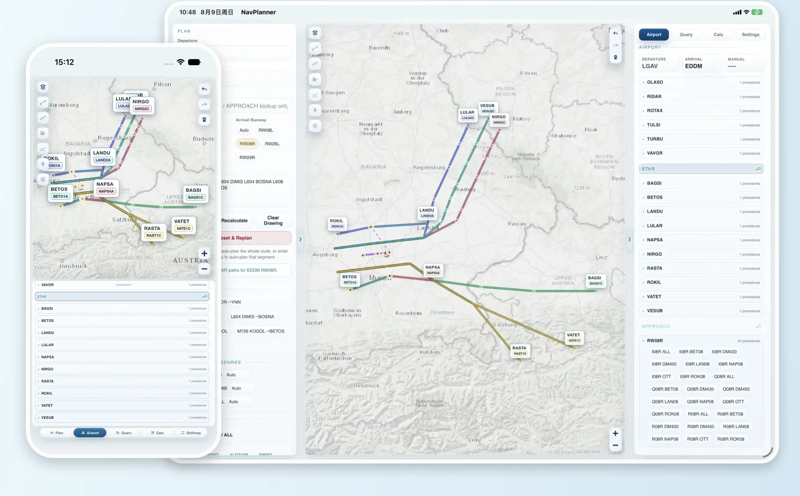
</picture><br />

<p>
  <a href="https://github.com/MDX-Tom/simnav-studio/stargazers"></a>
  
  
  
</p>

<p>
  <a href="README.md"></a>
  <a href="README.zh-CN.md"></a>
</p>

<h1>SimNav Studio</h1>

<p><strong>Planning &amp; Navigation for Flight Simulation</strong></p>
<p>From route planning to map review—an all-in-one flight-simulation workspace with local computation.</p>
<p>iPhone &amp; iPad App · macOS App · Local Web · One shared local-first core</p>

<p>
  <a href="#overview">Overview</a> ·
  <a href="#highlights">Highlights</a> ·
  <a href="#showcase">Showcase</a> ·
  <a href="#workflows">Workflows</a> ·
  <a href="#architecture">Architecture</a> ·
  <a href="#build-from-source">Build</a>
</p>

</div>

<!-- README_SYNC: Keep README.md and README.zh-CN.md structurally aligned; visual assets must work in both light and dark themes. -->

<a id="overview"></a>

## Overview ✈️

SimNav Studio is a local-first planning desk for flight simulation, delivered as an **iPhone / iPad App**, a **macOS App**, and **Local Web** for a browser on the same computer. It brings **route planning**, **airport and procedure inspection**, **FR24 track download, comparison, and matching**, **offline maps**, and **local navigation databases** into one workspace—connecting an end-to-end workflow from route idea to map review while keeping core features available offline.

The Apple Apps use a SwiftUI shell around the shared Web workspace; Local Web serves that exact same `NavPlanner/Resources/Web/` tree over localhost. Both transports call the same Swift planner and database runtime, so there is no second UI or business backend to synchronize. Apple data remains in the App sandbox, while Local Web uses its own data root.

| Formal platform | Delivery | Current source status |
|---|---|---|
| **iOS / iPadOS App** | Universal App / unsigned release IPA | Supported |
| **macOS App** | Universal Mac Catalyst App / ad-hoc DMG | Supported |
| **Local Web** | localhost browser on macOS, Windows, and Linux | One shared request processor and Swift core; Hummingbird serves macOS/Linux, while Windows uses the native SwiftNIO adapter when its host-built bundle is included and otherwise uses the Docker Desktop fallback. |

<p align="center">
  <strong>Route idea</strong> → <strong>Automatic planning</strong> → <strong>Procedure selection</strong> → <strong>Flight profile calculation</strong> → <strong>Map replay</strong>
</p>

> [!CAUTION]
> **For flight simulation only.** SimNav Studio is not certified aviation software and must not be used for real-world flight planning, navigation, dispatch, operational decisions, or any safety-critical aviation activity.

<a id="highlights"></a>

## Highlights ✨

|  | Capability | What it brings |
|:--:|---|---|
| 🧭 | **Local route planning** | Build and draw a route from departure to arrival, leave Route blank for full auto-planning, or insert `***` between fixes to auto-plan one segment. |
| 🛬 | **Airport & procedure inspection** | Browse runways, frequencies, `SID`, `STAR`, and `APPROACH` paths, including RF / AF arcs, missed approaches, and holding geometry. |
| 🗺️ | **Layered map workspace** | Toggle basemaps, route types, procedures, FR24 tracks, waypoints, navaids, runways, ILS, and airway labels; undo, redo, or clear drawn tracks. |
| 📐 | **Flight calculation desk** | Configure aircraft, weight, fuel, cruise, descent, weather, and QNH; review wind / terrain and ground-speed / vertical-speed profiles plus a SimBrief-style fuel estimate. |
| 📡 | **FR24 track comparison** | Query first through the shared background backend; only if FR24 requests verification, open and sync the App session on Apple or the isolated SimNav profile on Local Web. Download, draw, and match tracks without an official API credential; GPX and FR24 CSV/KML import remain available. |
| 💾 | **Offline map library** | Import or download PMTiles, MBTiles, SQLite tile stores, and legacy Web `tiles/` layouts while managing online cache separately. |
| 🗄️ | **Local navigation databases** | Import `.s3db`, `.sqlite`, `.sqlite3`, or `.db`, switch databases, remove unused copies, and restore the bundled database. |

<a id="showcase"></a>

## Interface Showcase 🖥️

<table align="center" width="80%">
  <tr>
    <td align="center"><strong>Light · iPhone 17 Pro portrait</strong><br />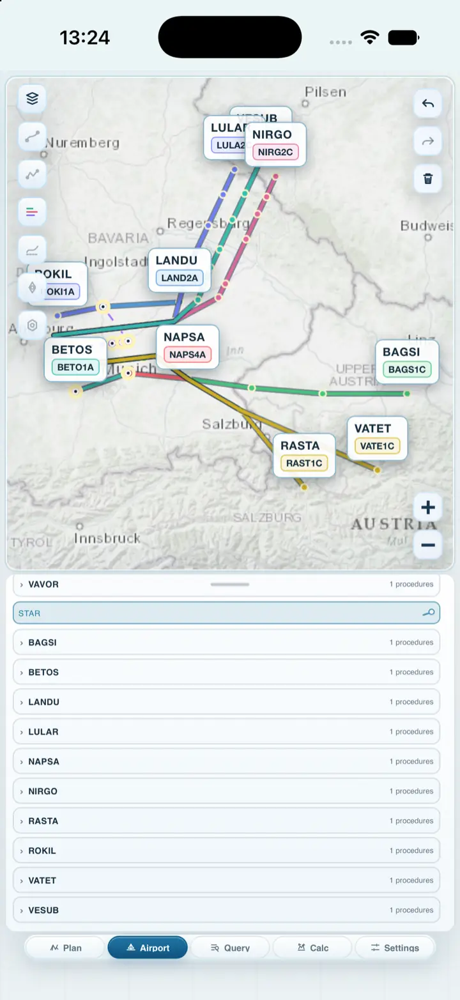</td>
    <td align="center"><strong>Light · iPad Pro 13-inch landscape</strong><br />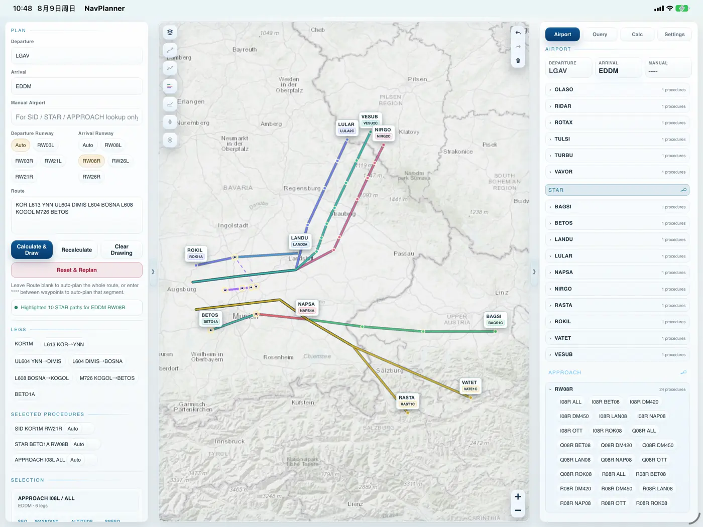</td>
  </tr>
  <tr>
    <td align="center"><strong>Dark · iPhone 17 Pro portrait</strong><br />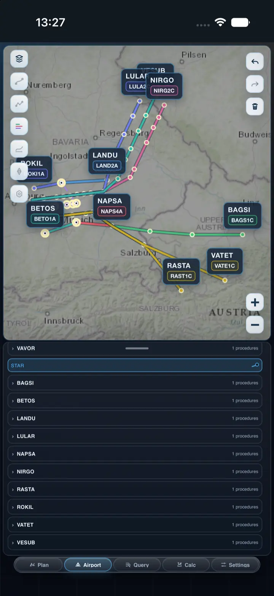</td>
    <td align="center"><strong>Dark · iPad Pro 13-inch landscape</strong><br />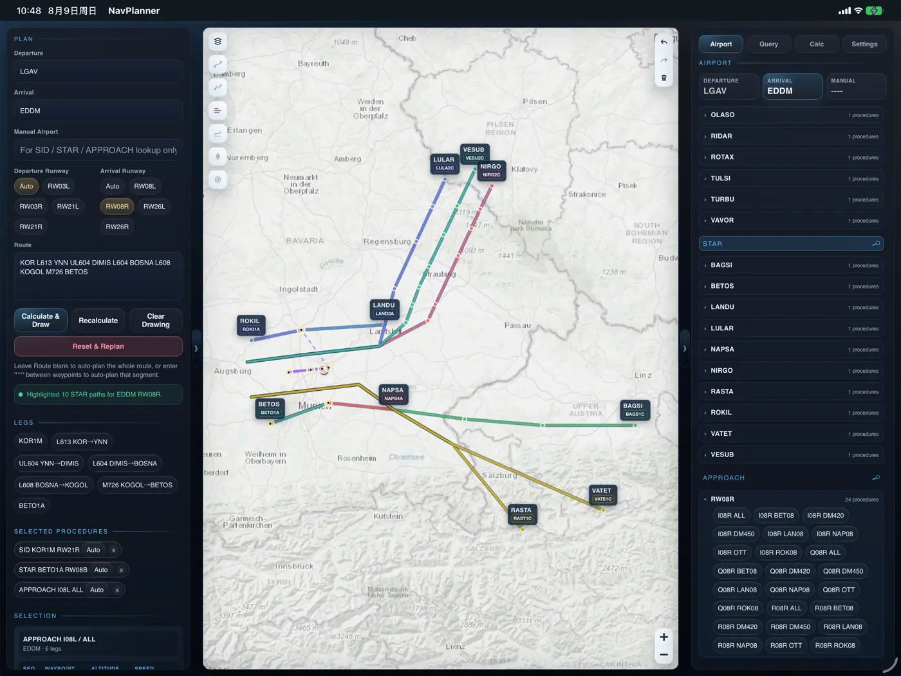</td>
  </tr>
</table>

<p align="center"><sub>Interface showcase: EDDM RW08R STAR procedure preview.</sub></p>

<a id="workflows"></a>

## Core Workflows 🧭

<details open>
<summary><strong>1 · Plan and draw a route</strong></summary>

1. Open the **Plan** tab.
2. Enter departure and arrival airports, for example `KLAX` and `KJFK`.
3. Pick runways or keep automatic selection.
4. Enter a route string, leave it blank for full auto-planning, or use `***` between fixes to auto-plan a segment.
5. Tap **Generate & Draw Route**.

<table align="center" width="92%">
  <tr>
    <th align="center">iPhone</th>
    <th align="center">iPad/macOS</th>
  </tr>
  <tr>
    <td align="center"><picture><source media="(prefers-color-scheme: dark)" srcset="Media/workflows/en/night/01-plan-iphone.webp" /><source media="(prefers-color-scheme: light)" srcset="Media/workflows/en/day/01-plan-iphone.webp" />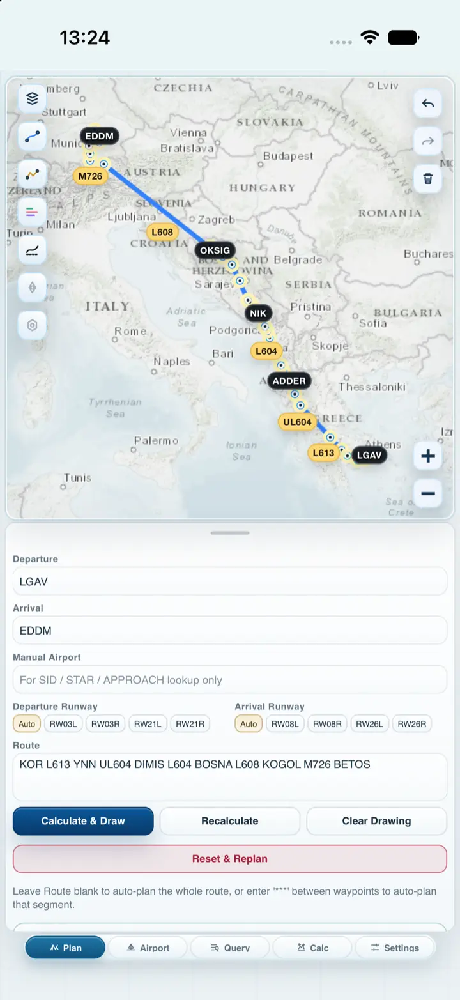</picture></td>
    <td align="center"><picture><source media="(prefers-color-scheme: dark)" srcset="Media/workflows/en/night/01-plan-ipad.webp" /><source media="(prefers-color-scheme: light)" srcset="Media/workflows/en/day/01-plan-ipad.webp" />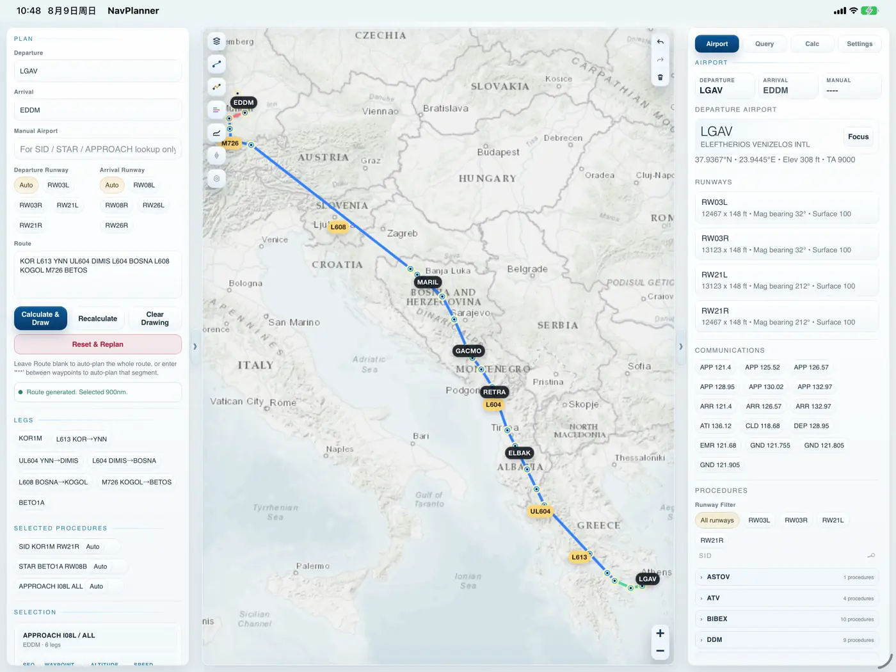</picture></td>
  </tr>
</table>

</details>

#

<details open>
<summary><strong>2 · Inspect airports and procedures</strong></summary>

1. Build a route, then open the **Airport** tab and switch to the EDDM arrival slot.
2. Select a runway such as `RW08R` and review the filtered procedure lists.
3. Tap the **STAR** heading to preview all matching STAR paths, or tap one procedure to focus its path.
4. Review runway data, communication frequencies, and the visible procedure geometry together.

<table align="center" width="92%">
  <tr>
    <th align="center">iPhone</th>
    <th align="center">iPad/macOS</th>
  </tr>
  <tr>
    <td align="center"><picture><source media="(prefers-color-scheme: dark)" srcset="Media/workflows/en/night/02-procedure-iphone.webp" /><source media="(prefers-color-scheme: light)" srcset="Media/workflows/en/day/02-procedure-iphone.webp" /></picture></td>
    <td align="center"><picture><source media="(prefers-color-scheme: dark)" srcset="Media/workflows/en/night/02-procedure-ipad.webp" /><source media="(prefers-color-scheme: light)" srcset="Media/workflows/en/day/02-procedure-ipad.webp" /></picture></td>
  </tr>
</table>

</details>

#

<details open>
<summary><strong>3 · Calculate profiles and fuel</strong></summary>

1. Build a route in **Plan** and select any required `SID`, `STAR`, or `APPROACH`.
2. Open **Calc**, select manufacturer and aircraft type, then adjust ZFW, fuel on board, cruise altitude, cruise Mach, descent rate, weather source, weight unit, and QNH unit.
3. Review the SimBrief-style route profile with relative wind, cloud, precipitation, terrain, procedure altitude limits, QNH, zoom, and pan controls.
4. Check the ground-speed / vertical-speed profile and fuel estimate.

The calculation model is local-first and works offline. Online weather is an enhancement and falls back to local estimates when unavailable; Terrarium DEM tiles are sampled when available and degrade to a conservative local terrain estimate when unavailable. Direct weather-source licensing, offline DEM packages, and fuller aircraft-performance libraries remain planned enhancements.

<table align="center" width="92%">
  <tr>
    <th align="center">iPhone</th>
    <th align="center">iPad/macOS</th>
  </tr>
  <tr>
    <td align="center"><picture><source media="(prefers-color-scheme: dark)" srcset="Media/workflows/en/night/03-calculate-iphone.webp" /><source media="(prefers-color-scheme: light)" srcset="Media/workflows/en/day/03-calculate-iphone.webp" />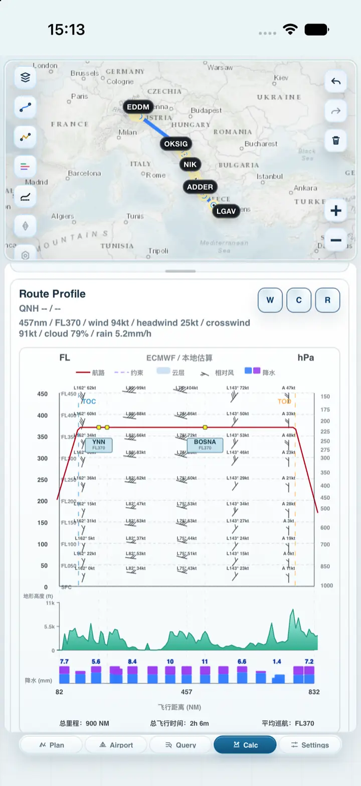</picture></td>
    <td align="center"><picture><source media="(prefers-color-scheme: dark)" srcset="Media/workflows/en/night/03-calculate-ipad.webp" /><source media="(prefers-color-scheme: light)" srcset="Media/workflows/en/day/03-calculate-ipad.webp" />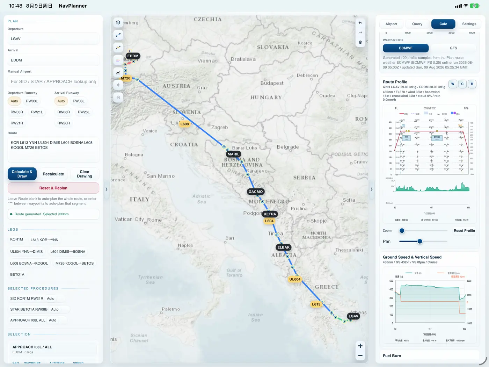</picture></td>
  </tr>
</table>

</details>

#

<details open>
<summary><strong>4 · FR24 tracks: query, download, replay, and match</strong></summary>

1. Fill departure and arrival airports in Plan, then open **Query**.
2. Query up to 10 recent flights for the route, or search a flight number / flightId manually. Apple and Local Web first use the shared FR24 backend in the background; no official API credential is requested.
3. Only if FR24 actually requests verification, explicitly open **FR24 Verification**, complete the normal FR24 / Cloudflare check, then select **Sync Browser Session**. Apple uses the App's WebKit session; Local Web shows the FR24 homepage in an isolated SimNav Chrome / Chromium / Edge profile. The launcher uses a randomized non-zero private loopback control port, so the visible page keeps normal browser semantics (`navigator.webdriver=false`). The homepage remains the only visible verification tab; short-lived schedule/playback targets stay in the background and close if challenged.
4. Download and draw a track, import GPX or an authorized FR24 CSV/KML export, inspect altitude / speed profiles, or match the current track against the local route engine.

Flights that have not departed are shown as deep-gray scheduled cards. Because FR24 has no actual playback for them yet, SimNav Studio clearly labels the limitation and can draw a dashed preview generated by the local auto-planner; the dashed line is not presented as an actual or filed FR24 track.

When a loaded flight reports different actual airports, Query synchronizes them back to Plan before matching. For dense tracks with reliable terminal samples, matching identifies the complete SID / STAR / Approach first, then fits the enroute airway between procedure boundaries.

Downloaded tracks are cached locally as GPX, playback JSON, and metadata. Query can search the cache, draw or match cached tracks, share GPX, favorite important tracks, open the cache folder, and clear non-favorited downloads.

> **Online enhancement.** FR24 is optional. Local Web keeps its dedicated browser profile under the independent Local Web data root and never reads the user's normal browser profile or exports its cookies. Startup, schedule lookup, and playback download use the managed browser process in the background; a browser window is shown only after the user explicitly chooses **Open FR24 Verification Page**. Its DevTools listener stays on a randomized non-zero loopback port; this avoids falsely exposing the visible browser as WebDriver automation while keeping control inaccessible from the LAN. Network, session, or verification failures never block local planning, airport lookup, procedures, nav overlays, or offline maps. SimNav Studio does not bypass Cloudflare or automate CAPTCHA challenges.

<table align="center" width="92%">
  <tr>
    <th align="center">iPhone</th>
    <th align="center">iPad/macOS</th>
  </tr>
  <tr>
    <td align="center"><picture><source media="(prefers-color-scheme: dark)" srcset="Media/workflows/en/night/04-fr24-iphone.webp" /><source media="(prefers-color-scheme: light)" srcset="Media/workflows/en/day/04-fr24-iphone.webp" />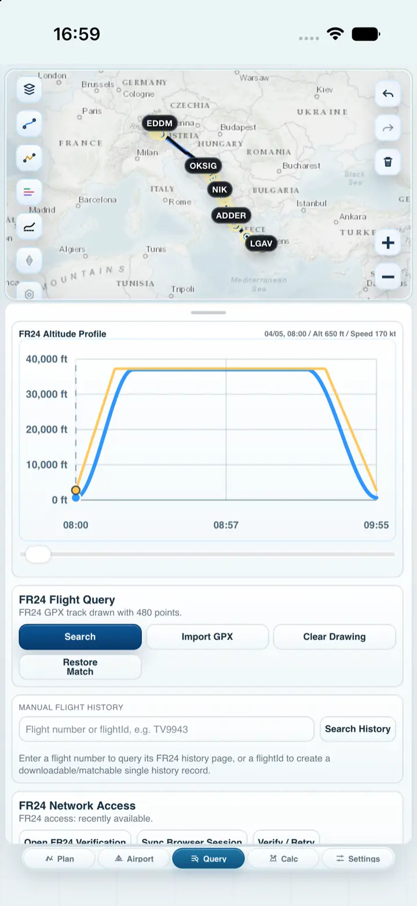</picture></td>
    <td align="center"><picture><source media="(prefers-color-scheme: dark)" srcset="Media/workflows/en/night/04-fr24-ipad.webp" /><source media="(prefers-color-scheme: light)" srcset="Media/workflows/en/day/04-fr24-ipad.webp" />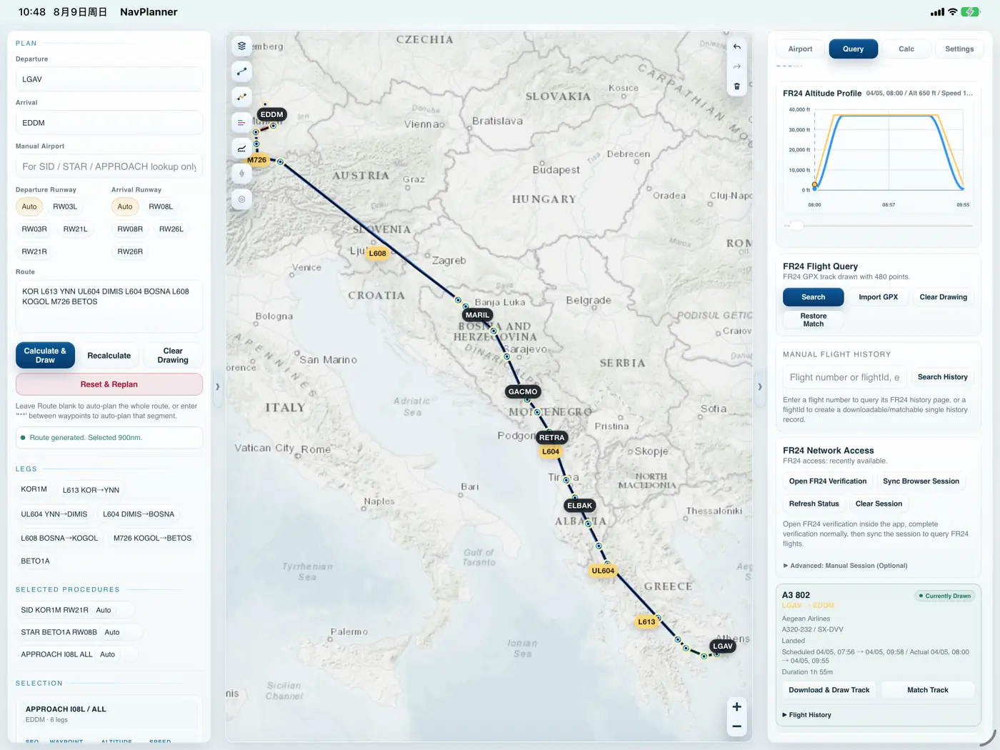</picture></td>
  </tr>
</table>

</details>

#

<details open>
<summary><strong>5 · Manage offline maps and navigation databases</strong></summary>

**Offline maps**

1. Open **Settings** → **Manage Offline Maps**.
2. Import or download PMTiles, MBTiles, or SQLite tile resources.
3. Select an active resource to make the map prefer local tiles.

Online map cache and offline packages are managed separately. Clearing the online cache does not remove imported maps or navigation databases.

**Navigation databases**

1. In **Settings** → **Navigation Database**, tap **Choose s3db**.
2. Pick a `.s3db`, `.sqlite`, `.sqlite3`, or `.db` file from Files; its format must match the [custom navigation-database compatibility](#nav-db-compatible-format) section below.
3. SimNav Studio switches to the imported database and refreshes route, procedure, and nav-overlay caches.

**Appearance and UI scale**

1. Open **Settings** → **Appearance** to follow the system theme or select light/dark mode.
2. **Dark Mode Map** is off by default, so a dark UI keeps the same map source and colors as the light UI. When enabled, SimNav requests the provider's native dark tiles—without a darkening overlay or color filter—and automatically switches an unsupported source to ArcGIS World Dark Gray.
3. UI Zoom provides `-1`, `0`, `+1`, and `+2`; level `0` is the default and every step changes the current device layout by 8%. In Local Web, level `0` / `100%` is 92% of the former level-0 size (an effective browser scale of 82.8%), without changing Apple layout baselines.
4. Text, controls, panels, and map chrome scale together. The geographic map zoom is unchanged; Apple and Local Web execute the same UI source while retaining their platform-specific level-0 baselines.
5. Icon style 2, Day / Default, is the fresh-install default. Settings keeps all three icon styles and their Day/Night High, Default, and Soft variants available.

<a id="nav-db-compatible-format"></a>
<details>
<summary><strong>Custom navigation-database compatibility</strong></summary>

It is recommended to use the PMDG aircraft navigation database
`e_dfd_PMDG.s3db`, or customize a copy of it.

The extension is only a file-picker filter: the imported file must be a valid
**SQLite 3** database using the PMDG-style navigation schema queried by
SimNav Studio. The app copies an import into its sandbox and opens that copy
read-only. It does not convert CSV, JSON, ARINC 424 source text, encrypted
databases, or arbitrary SQLite schemas.

Full route-planning, airport, procedure, and overlay compatibility requires
these tables and their existing PMDG field names:

| Data area | Required tables and principal fields |
|---|---|
| Cycle metadata | `tbl_header` (`current_airac`, `revision`; one header row) |
| Airports | `tbl_airports` (`airport_identifier`, `iata_ata_designator`, `airport_name`, `airport_ref_latitude`, `airport_ref_longitude`) |
| Runways & communications | `tbl_runways` (airport/runway identifiers, threshold coordinates, bearing and dimensions), `tbl_airport_communication` (airport identifier, type, frequency and callsign) |
| Fixes & navaids | `tbl_enroute_waypoints`, `tbl_terminal_waypoints`, `tbl_vhfnavaids`, `tbl_enroute_ndbnavaids`, `tbl_terminal_ndbnavaids` (identifier/name, latitude/longitude and the table's type/frequency fields) |
| Airways | `tbl_enroute_airways` (`route_identifier`, `seqno`, waypoint identifier/coordinates, direction, route type, altitude/course/distance fields) |
| Procedures | `tbl_sids`, `tbl_stars`, `tbl_iaps` (airport/procedure/transition identifiers, `route_type`, `seqno`, waypoint coordinates, path termination, course/arc, altitude/speed and recommended/center-fix fields) |
| ILS | `tbl_localizers_glideslopes` (airport/runway/localizer identifiers, localizer coordinates, bearing and frequency) |

Identifiers should use their normal uppercase ICAO/PMDG values; latitude and
longitude are WGS 84 decimal degrees; procedure and airway sequence values must
sort in flight-path order. Bearings/courses, runway dimensions, altitude fields,
frequencies, route types, and path terminators must retain the units and
semantics of the PMDG schema (the app interprets runway length as feet).
Additional tables and indexes are allowed, but renaming the queried tables or
columns is not.

Before importing, a basic integrity and schema check can be run with:

```bash
sqlite3 -readonly custom.s3db "PRAGMA quick_check;"
sqlite3 -readonly custom.s3db \
  "SELECT current_airac, revision FROM tbl_header LIMIT 1;"
sqlite3 -readonly custom.s3db \
  "SELECT name FROM sqlite_master WHERE type='table' ORDER BY name;"
```

`PRAGMA quick_check` should return `ok`. A database that merely opens but lacks
the required tables or columns may import successfully while affected features
return no data. You are responsible for the accuracy, legality, and import or
redistribution rights of every custom database.

</details>

<table align="center" width="92%">
  <tr>
    <th align="center">iPhone</th>
    <th align="center">iPad/macOS</th>
  </tr>
  <tr>
    <td align="center"><picture><source media="(prefers-color-scheme: dark)" srcset="Media/workflows/en/night/05-settings-iphone.webp" /><source media="(prefers-color-scheme: light)" srcset="Media/workflows/en/day/05-settings-iphone.webp" />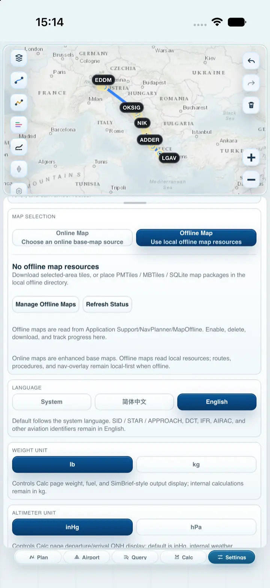</picture></td>
    <td align="center"><picture><source media="(prefers-color-scheme: dark)" srcset="Media/workflows/en/night/05-settings-ipad.webp" /><source media="(prefers-color-scheme: light)" srcset="Media/workflows/en/day/05-settings-ipad.webp" />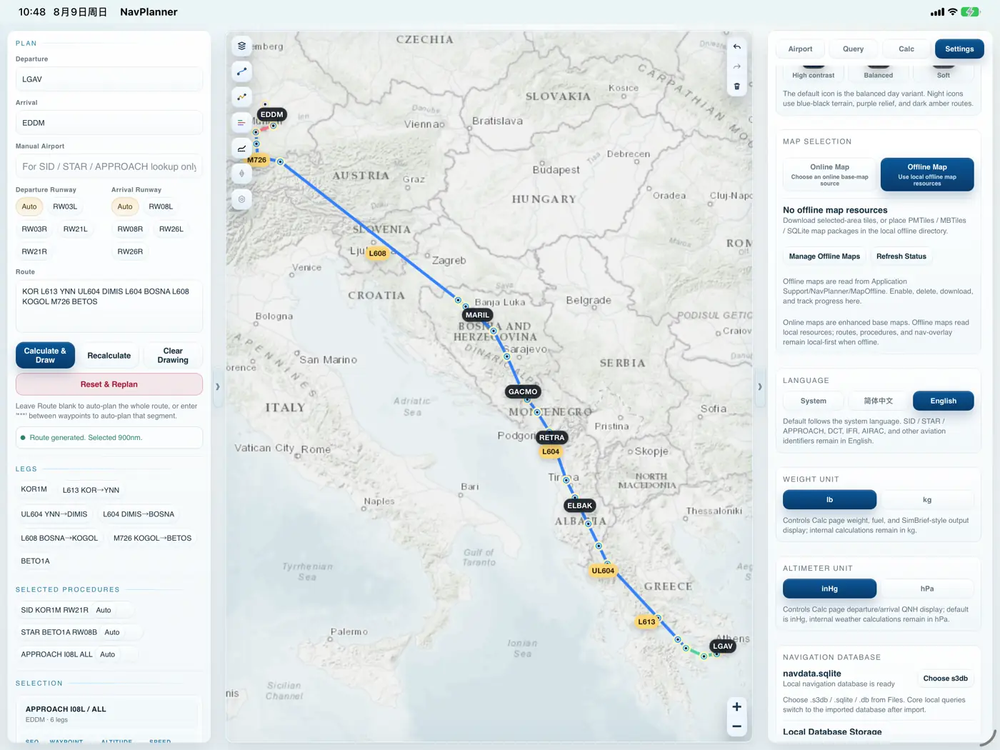</picture></td>
  </tr>
</table>

</details>

<a id="architecture"></a>

## Architecture 🏗️

The architecture is organized around the user-facing core workflow rather than starting from frameworks. Each numbered stage expands as **feature entry → local API → implementation principle → returned payload**, while the shared runtime and local data plane stay visible across the whole path.

<picture>
  <source media="(prefers-color-scheme: dark)" srcset="Media/architecture/project-architecture-en-dark.webp" />
  <source media="(prefers-color-scheme: light)" srcset="Media/architecture/project-architecture-en-light.webp" />
  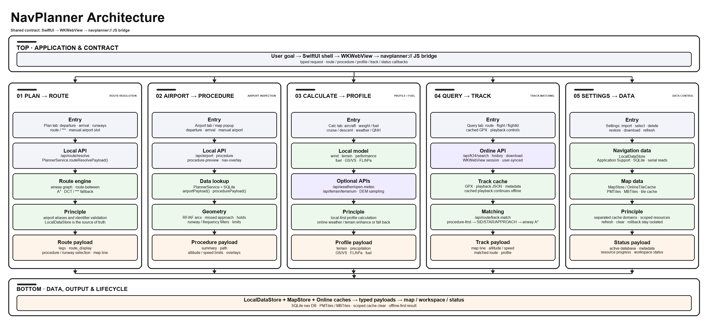
</picture>

The numbered workflow makes the dependency direction explicit: route planning produces the payload consumed by Airport, Calc, and Query; Procedure selection constrains both profile calculation and track matching; Settings feeds the local database and map stores that every offline path depends on. The arrows also expose the implementation principles:

| Principle | Implementation boundary | Result |
|---|---|---|
| **Local-first core** | `PlannerService` + `LocalDataStore` + `MapStore` | Route resolution, procedures, nav-overlay, local maps, and database inspection continue without network access. |
| **Procedure-first matching** | actual-airport sync → terminal procedure fit → airway A* → smoothing | Recorded tracks preserve SID / STAR / APPROACH context before enroute matching. |
| **Online as enhancement** | FR24 session, Open-Meteo, and Terrarium DEM are dashed optional paths | Network/session failures fall back to local estimates and do not replace the core workflow. |
| **Typed payload boundaries** | shared `SimNavRuntimeRouter` behind `navplanner://` and localhost HTTP adapters | Each stage returns the same typed payload through WebKit or HTTP without sharing storage internals. |
| **Separated cache domains** | SQLite navigation DB, offline map packages, online tile cache, and FR24 cache | Import, refresh, clear, and rollback operations stay scoped to the resource they own. |

<a id="build-from-source"></a>

## Build From Source 🛠️

### Requirements

- Apple Apps: macOS with Xcode, an iOS 17.0-or-later deployment target, and an iPhone / iPad Simulator, Mac Catalyst destination, or physical device
- Local Web from source: macOS 14 or later, Swift 6.1 or later, and `curl`
- Packaged Local Web: the bundled macOS server runs natively; Windows runs the bundled SwiftNIO `.exe` directly when a Windows-smoked native bundle is included, otherwise it uses Docker Desktop; Linux requires Docker Engine with Compose v2
- Optional local navigation database for private App or Local Web builds

### Quick start

```bash
git clone https://github.com/MDX-Tom/simnav-studio.git
cd simnav-studio
Tools/Signing/setup_local_signing.sh
open NavPlanner.xcodeproj
```

The signing helper reads the Team ID from a valid Apple Development certificate
and writes it only to the Git-ignored
`Config/CodeSigning.local.xcconfig`. If your account cannot provision the public
Bundle Identifier, pass a private override such as
`--bundle-id com.example.simnavstudio`. Simulator builds do not require signing.
For a physical device, first add your Apple Account and create an Apple
Development certificate in Xcode if the helper reports that no identity exists.
If Xcode later reports that no profile is available or that a profile expired,
open **Xcode → Settings → Accounts**, refresh the Apple Account and certificates,
then rerun the helper. Account credentials remain in Xcode and Keychain and must
never be copied into this repository.

The product is branded **SimNav Studio** and appears under the short icon name
**SimNav**. Its Bundle Identifier is `com.mdxtom.simnavstudio`. The existing
`NavPlanner.xcodeproj`, `NavPlanner` scheme, executable, and app-data path names
remain unchanged for source compatibility. Because the Bundle Identifier has
changed, Apple platforms treat this build as a separate app from installations
using the previous identifier; their sandbox data does not migrate automatically.

In Xcode, select the **NavPlanner** scheme, choose an iPhone, iPad, or Mac
Catalyst destination, and run the app. Xcode automatically reads the ignored
local configuration; it does not write the Team ID into the tracked project.

For Debug or private builds, place a local database at
`NavPlanner/Resources/Database/navdata.sqlite`, or import one from Settings after
launch. Public release builds do not use that development copy:
`Tools/Release/build_public_release.sh` requires the latest local
`database/e_dfd_PMDG_release.s3db`, validates it, and temporarily bundles it as
`Database/navdata.sqlite` in both the IPA and DMG. Both database locations are
Git-ignored.

### Run Local Web

The Local Web development entry starts the native server on
`http://127.0.0.1:8010`, serves the canonical App Web resources directly, and
copies the selected database into a separate Local Web data directory:

```bash
Tools/LocalWeb/run.sh
```

In a development checkout the script automatically detects the Git-ignored
`database/e_dfd_PMDG_release.s3db` when present. You can also select inputs
explicitly:

```bash
Tools/LocalWeb/run.sh \
  --database /path/to/navigation.s3db \
  --data-dir /path/to/simnav-web-data \
  --port 8010
```

Press Control-C to stop the server. It binds only to `127.0.0.1`; Host and
Origin are restricted to loopback, and state-changing requests require the
per-process token injected into the shared page. A database imported or selected
in Settings remains active after the native process or container restarts.
Tracked packaging generates `releases/release-<version>/web-bundle/SimNav-Studio-<version>-web.zip`;
it extracts to `SimNav-Studio-<version>-web/` with the macOS, Windows, and Linux launchers. The Windows launcher runs
`simnav-local-web.exe` and its bundled runtime DLLs directly when a
Windows-smoked native bundle is present—without installing Swift or starting
Linux, WSL, or Docker—and otherwise falls back to Docker Desktop. Linux builds
and runs the native Swift executable inside the pinned container. Docker launchers keep the
dedicated FR24 Chrome/Chromium/Edge subprocess off-screen on the host: Linux connects through a
private Compose-gateway relay, while Windows uses an ephemeral authenticated host relay. A window
appears only when the user explicitly opens the FR24 verification page; normal Query, history, and
playback requests remain in the background without an official API credential or a second FR24
backend. All three launch paths use a randomized non-zero loopback DevTools port so the verification
page reports `navigator.webdriver=false`; only the private relay can reach it in Docker mode. The v0.1.2
candidate is generated from the same reviewed source commit as the Apple
artifacts.

The browser does not execute Swift itself: each launcher starts a loopback HTTP
process. Hummingbird 2.22.0 is used on macOS/Linux but does not support Windows,
so the Windows executable uses a thin direct SwiftNIO 2.101.3 transport over the
same request processor and `SimNavRuntimeRouter`. This is a native Windows
process, not a Linux server.

<details>
<summary><strong>Command-line build</strong></summary>

```bash
xcodebuild -project NavPlanner.xcodeproj \
  -scheme NavPlanner \
  -configuration Debug \
  -destination 'generic/platform=iOS Simulator' \
  -derivedDataPath /private/tmp/NavPlannerDerived \
  build
```

If `xcode-select` points to Command Line Tools, set the full Xcode developer directory explicitly:

```bash
DEVELOPER_DIR=/Applications/Xcode.app/Contents/Developer \
xcodebuild -project NavPlanner.xcodeproj \
  -scheme NavPlanner \
  -configuration Debug \
  -destination 'generic/platform=iOS Simulator' \
  -derivedDataPath /private/tmp/NavPlannerDerived \
  build
```

</details>

### Install the iOS, macOS, and Web Releases

<details>
<summary><strong>Why this matters</strong></summary>

Public GitHub IPA assets must be unsigned sideload packages. They must not
contain a maintainer certificate, Team ID, provisioning profile, account email,
private key, App Store Connect key, xcarchive, or raw build log.

Local Apple Development settings belong only in the Git-ignored
`Config/CodeSigning.local.xcconfig`. The tracked
`Config/CodeSigning.xcconfig` optionally includes that file, so Xcode GUI builds
work locally while a fresh clone and public unsigned builds contain no private
identity. A Mac artifact without private CI credentials is ad-hoc signed and
not notarized; Developer ID/App Store signing, if ever used, must import
credentials only from protected CI secrets. See
[public release packaging](Tools/Release/README.md).

</details>

**Installing the iPhone app requires AltStore, SideStore, Sideloadly, or another
trusted signing workflow that re-signs it with your own account.**

<details>
<summary><strong>Install on iPhone, iPad, Mac, and Local Web</strong></summary>

#### iPhone and iPad

The GitHub IPA is unsigned, contains no maintainer certificate or provisioning
profile, and cannot be installed directly.

1. Download the `-unsigned.ipa` and `SHA256SUMS.txt`, then verify the checksum. The release-root
   checksum file lists exactly the iOS IPA, macOS DMG, and Web ZIP.
2. Import the IPA into AltStore, SideStore, Sideloadly, or another signing tool
   you trust.
3. Let that tool re-sign the IPA with your own Apple Account and install it.
4. Follow the tool and device prompts to trust the resulting local signature;
   enable Developer Mode only when iOS/iPadOS requests it.

Alternatively, you can install directly from local Xcode by running
`Tools/Signing/setup_local_signing.sh`, connecting the device, selecting it as
the internal **NavPlanner** scheme destination, and pressing Run. The generated signing file remains
only on that Mac and is ignored by Git.

#### Mac

1. Download the `-catalyst-adhoc.dmg` and verify its SHA-256.
2. Open the DMG and drag the bundled `SimNav-Studio-<version>-catalyst-adhoc.app` to Applications.
3. On first launch, Control-click the app and choose **Open**. If macOS still
   blocks it, use **System Settings → Privacy & Security → Open Anyway** only
   after verifying the checksum and download source.

The current Mac build is a universal arm64/x86_64 Mac Catalyst app. It is
ad-hoc signed and not notarized, so it does not have Developer ID/Gatekeeper
public-distribution trust; it is not a native AppKit app or a Designed-for-iPad
wrapper.

#### Local Web

Local Web is the third formal release platform. A Web-enabled release places
its launchers and required payload inside `web-bundle/SimNav-Studio-<version>-web.zip`;
after extraction the package root is `SimNav-Studio-<version>-web/`. macOS uses
`run-macos.command`, Linux uses `run-linux.sh`, and Windows uses
`run-windows.ps1`. The macOS launcher prefers its universal native binary;
Windows prefers a packaged native SwiftNIO `.exe` and uses Docker only when that
bundle is absent; Linux builds the same Swift core with Hummingbird in Docker. In Docker mode the
managed FR24 browser stays off-screen on the host and is connected through a restricted host bridge
(private Compose gateway on Linux, authenticated relay on Windows); only the explicit verification
action reveals its window, while all FR24 business logic stays in the shared Swift core. Every container port is
published only to `127.0.0.1`; stop scripts handle recorded native processes or Docker and preserve
the Local Web data root / named volume.
The Web package includes the exact release-selected navigation database shipped in the IPA/DMG and
activates a private copy on first launch. It contains no user map, track, FR24 session, cache, or token;
import additional data you are permitted to use from the browser. The tracked release
builder and audit generate and validate this payload as part of the v0.1.2
candidate.

</details>

<a id="validation"></a>

## Validation & Release Checks ✅

<details>
<summary><strong>Useful local checks</strong></summary>

```bash
node --check NavPlanner/Resources/Web/app.js
node --check NavPlanner/Resources/Web/runtime.js
node --check NavPlanner/Resources/Web/vendor/maplibre-gl/maplibre-gl.js
plutil -lint NavPlanner.xcodeproj/project.pbxproj NavPlanner/Support/PrivacyInfo.xcprivacy
python3 Tools/Parity/run_all_parity.py
swift test
swift build --product simnav-local-web
Tools/LocalWeb/package_web_release.sh --output /tmp/SimNav-Web-check
Tools/LocalWeb/audit_web_release.sh /tmp/SimNav-Web-check --docker-smoke
```

`Tools/Parity` compiles the shared Swift core and checks versioned Route 22, Track 10, and Procedure 6 behavior fixtures after route-planning, track-matching, or procedure-geometry changes.

</details>

<details>
<summary><strong>Release checklist</strong></summary>

- Review `PrivacyInfo.xcprivacy` against actual network, file, cache, and optional FR24 behavior.
- Replace `database/e_dfd_PMDG_release.s3db` with the latest release database; verify its AIRAC, `PRAGMA quick_check`, bundled SHA-256 parity, and compatibility in both the IPA and DMG.
- Confirm licensing and distribution rights for the bundled example database, imported navigation databases, offline map packages, and basemap sources.
- Update version, build number, display name, signing, app icon, and alternate-icon metadata.
- Test iPhone compact width, iPhone landscape, iPad portrait, and iPad landscape.
- Verify airplane-mode launch, airport search, airport detail, route planning, procedure drawing, nav-overlay rendering, and offline maps.
- Verify Apple WebKit and Local Web dedicated-browser FR24 sessions, Cloudflare handling, route query, playback download, GPX/CSV/KML import, profile, failed-download, drawing, matching, sharing, and cache paths.
- Verify all three Web launchers, native Windows SwiftNIO artifact smoke when included, both HTTP transports, Docker loopback publication, data-volume persistence, exact IPA/DMG/Web database parity, and the absence of user data.
- Preserve every different `releases/release-<version>/` directory when building. A same-version rebuild may replace only that version, atomically and only after the new candidate passes all audits.
- Filter Xcode logs by the `NavPlanner` process; beta simulators may print unrelated system-service errors.

</details>

<a id="project-layout"></a>

## Project Layout 🗂️

```text
NavPlanner.xcodeproj/          Xcode project
NavPlanner/
  App/                         SwiftUI app entry and shell
  Core/                        Shared database, planner, map store, runtime, WebBridge
  Features/                    SwiftUI feature containers
  Resources/Web/               Single App + Local Web workspace source
  Support/                     Asset catalog and privacy manifest
LocalWeb/                      Shared HTTP processor, Hummingbird/SwiftNIO adapters, and SwiftPM tests
Package.swift                  Shared-core and Local Web SwiftPM graph
Tools/                         Local Web, release, signing, icon, and parity tools
Media/                         README screenshots and visual assets
```

<a id="data-notice"></a>

## Data & Safety Notice ⚠️

**SimNav Studio is a simulator-planning, inspection, and personal-learning aid only. For real-world aviation, always rely on official aeronautical publications, ATC instructions, certified avionics, and current operational procedures.**

SimNav Studio may use third-party or user-supplied materials, including basemaps, airport and procedure data, AIRAC / navigation databases, PMTiles / MBTiles / SQLite packages, and FR24 flight data. These materials may be subject to copyright, database rights, trademarks, platform terms, or redistribution restrictions.

The public GitHub source
repository does **not** include a navigation database: the root `database/`
directory and the development bundle resource are Git-ignored. Each locally generated release
candidate bundles one release-selected example database byte-for-byte in its IPA, DMG, and Web
artifacts, so all three platforms have the same first-launch sample data. The accompanying notice
requires written redistribution permission; the maintainers must not publish any artifact containing
that database until permission is confirmed.

Local Web keeps its writable database and caches separate from the Apple App.
The Web server copies and activates its bundled release database on first launch. Users may later
select their own compatible database through the documented import or mount flow.

This app does not guarantee the accuracy, completeness, availability, or legal status of third-party data. You are responsible for confirming your right to use, import, cache, and distribute each data source.
