<div align="center">

<picture>
  <source media="(prefers-color-scheme: dark)" srcset="Media/navplanner-hero-zh-Hans-dark.webp" />
  <source media="(prefers-color-scheme: light)" srcset="Media/navplanner-hero-zh-Hans.webp" />
  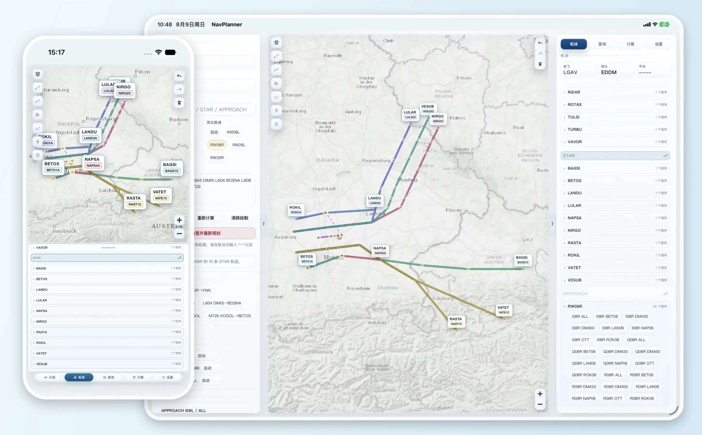
</picture><br />

<p>
  <a href="https://github.com/MDX-Tom/simnav-studio/stargazers"></a>
  
    
  
</p>

<p>
  <a href="README.md"></a>
  <a href="README.zh-CN.md"></a>
</p>

<h1>SimNav Studio</h1>

<p><strong>Planning &amp; Navigation for Flight Simulation</strong></p>
<p>从航路规划到地图复盘，一站式、本地计算的模拟飞行工作台。</p>
<p>iPhone &amp; iPad App · macOS App · Local Web · 同一套本地优先核心</p>

<p>
  <a href="#overview">项目概览</a> ·
  <a href="#highlights">功能亮点</a> ·
  <a href="#showcase">界面展示</a> ·
  <a href="#workflows">核心工作流</a> ·
  <a href="#architecture">系统架构</a> ·
  <a href="#build-from-source">源码构建</a>
</p>

</div>

<!-- README_SYNC: README.md 与 README.zh-CN.md 必须保持结构同步；视觉素材须同时适配亮色与暗色主题。 -->

<a id="overview"></a>

## 项目概览 ✈️

SimNav Studio 是一款本地优先的模拟飞行规划工作台，正式提供 **iPhone / iPad App**、**macOS App** 与运行在同一台电脑浏览器中的 **Local Web**。它把 **航路规划**、**机场与 Procedure 查看**、**FR24 轨迹下载、对照与拟合**、**离线地图**、**本地导航数据库**集中在同一个工作区中，在核心功能离线可用的基础上，串联从航线构思到地图复盘的完整流程。

Apple App 以 SwiftUI 构建外壳；Local Web 则从 localhost 直接提供完全相同的 `NavPlanner/Resources/Web/` 工作区。两种 transport 都调用同一个 Swift 规划与数据库 runtime，因此不需要维护第二套 UI 或业务后端。Apple 数据保存在 App 沙盒内，Local Web 使用独立数据根。

| 正式平台 | 交付形式 | 当前源码状态 |
|---|---|---|
| **iOS / iPadOS App** | Universal App / release 未签名 IPA | 已支持 |
| **macOS App** | Universal Mac Catalyst App / ad-hoc DMG | 已支持 |
| **Local Web** | macOS、Windows、Linux 本机 localhost 浏览器 | 共用同一请求处理器与 Swift 核心；macOS/Linux 使用 Hummingbird；Windows 在包含经宿主 smoke 的原生 bundle 时使用 SwiftNIO adapter，否则使用 Docker Desktop fallback。 |

<p align="center">
  <strong>航线构思</strong> → <strong>自动规划</strong> → <strong>Procedure 选择</strong> → <strong>飞行剖面计算</strong> → <strong>地图复盘</strong>
</p>

> [!CAUTION]
> **仅限模拟飞行。** SimNav Studio 不是认证航空软件，不得用于真实飞行计划、真实导航、签派放行、运行决策或任何安全关键航空活动。

<a id="highlights"></a>

## 功能亮点 ✨

|  | 能力 | 功能说明 |
|:--:|---|---|
| 🧭 | **本地航路规划** | 输入起飞机场、到达机场和航路文本并绘制航路；航路留空时自动规划整条航路，也可在航点间插入 `***` 自动规划片段。 |
| 🛬 | **机场与 Procedure 查看** | 查看跑道、通信频率、`SID`、`STAR`、`APPROACH`，并支持 RF / AF 弧线、复飞段和等待航线几何。 |
| 🗺️ | **多图层地图工作区** | 独立控制底图、各类航路、Procedure、FR24 轨迹、航点、导航台、跑道、ILS 和 airway 标签；支持撤销、重做与清除绘制。 |
| 📐 | **飞行计算工作台** | 配置机型、重量、燃油、巡航、下降、天气和 QNH，查看风速 / 地形、地速 / 垂直速度剖面及 SimBrief 风格燃油估算。 |
| 📡 | **FR24 轨迹对照** | 先通过共享后端直接查询。只有 FR24 实际要求验证时，Apple/macOS Local Web 才打开 App 自有 WebKit 会话，Windows/Linux Local Web 才打开隔离的 Chromium 验证会话，完成后自动同步并关闭。无需填写官方 API，即可下载、绘制并拟合轨迹，也可导入 GPX 或 FR24 CSV/KML。 |
| 💾 | **离线地图库** | 导入或下载 PMTiles、MBTiles、SQLite 瓦片库和 Web 旧版 `tiles/` 布局，并与在线地图缓存分开管理。 |
| 🗄️ | **本地导航数据库** | 导入 `.s3db`、`.sqlite`、`.sqlite3` 或 `.db`，切换数据库、删除未使用副本，并恢复内置数据库。 |

<a id="showcase"></a>

## 界面展示 🖥️

<table align="center" width="80%">
  <tr>
    <td align="center"><strong>亮色 · iPhone 17 Pro 竖屏</strong><br />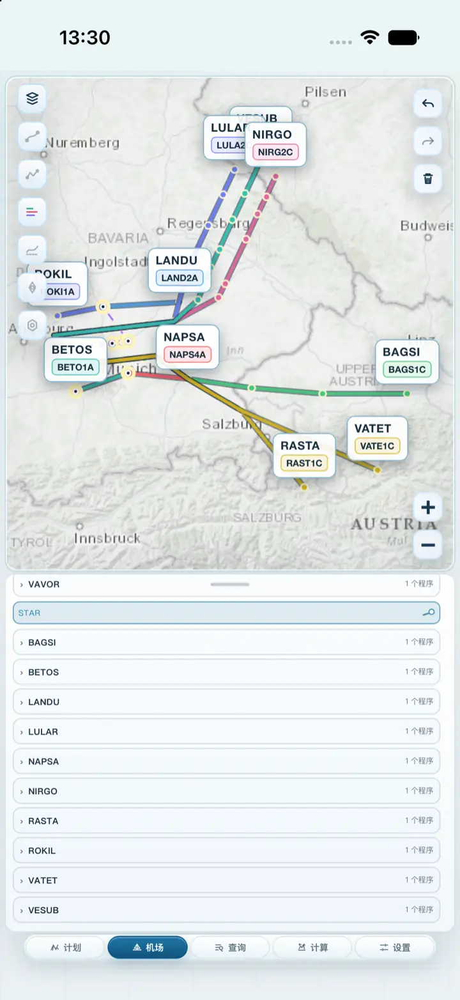</td>
    <td align="center"><strong>亮色 · iPad Pro 13 英寸横屏</strong><br />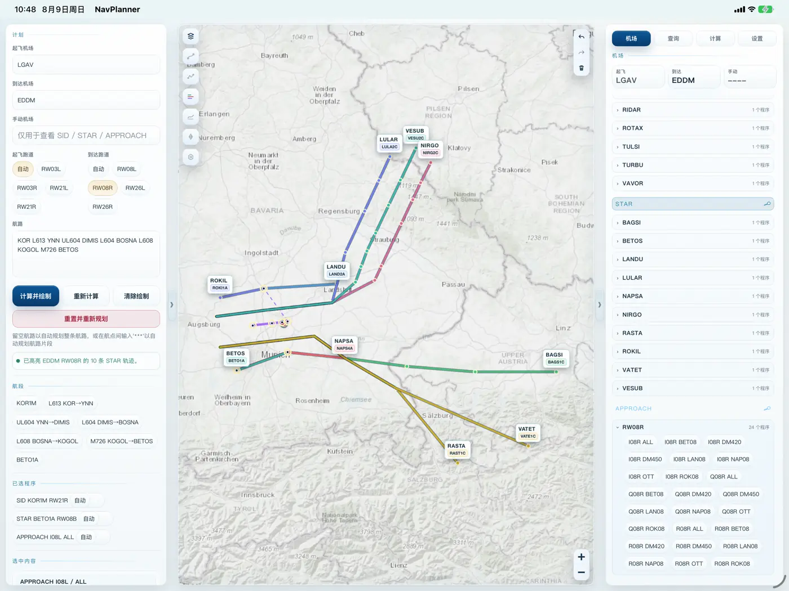</td>
  </tr>
  <tr>
    <td align="center"><strong>暗色 · iPhone 17 Pro 竖屏</strong><br />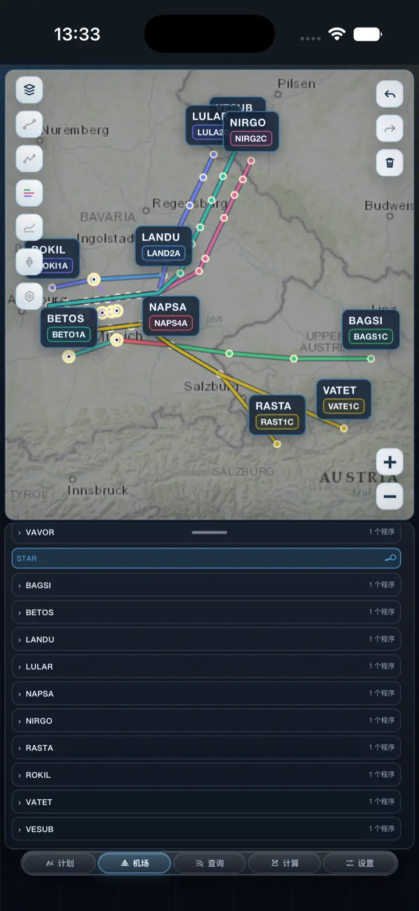</td>
    <td align="center"><strong>暗色 · iPad Pro 13 英寸横屏</strong><br />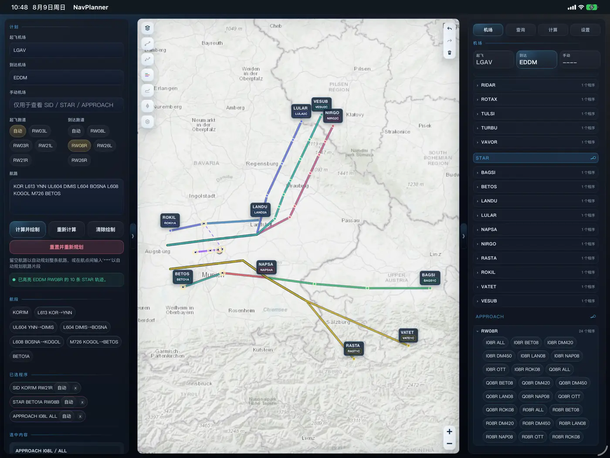</td>
  </tr>
</table>

<p align="center"><sub>界面展示：EDDM RW08R STAR 程序预览页面</sub></p>

<a id="workflows"></a>

## 核心工作流 🧭

<details open>
<summary><strong>1 · 规划并绘制航路</strong></summary>

1. 打开 **计划** 页。
2. 输入起飞机场和到达机场，例如 `KLAX` 与 `KJFK`。
3. 选择起飞 / 到达跑道，或保持自动选择。
4. 输入航路文本，留空自动规划整条航路，或在两个航点间输入 `***` 自动规划片段。
5. 点击 **生成并绘制航路**。

<table align="center" width="92%">
  <tr>
    <th align="center">iPhone</th>
    <th align="center">iPad/macOS</th>
  </tr>
  <tr>
    <td align="center"><picture><source media="(prefers-color-scheme: dark)" srcset="Media/workflows/zh-Hans/night/01-plan-iphone.webp" /><source media="(prefers-color-scheme: light)" srcset="Media/workflows/zh-Hans/day/01-plan-iphone.webp" />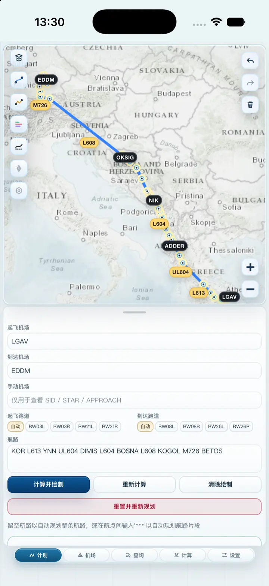</picture></td>
    <td align="center"><picture><source media="(prefers-color-scheme: dark)" srcset="Media/workflows/zh-Hans/night/01-plan-ipad.webp" /><source media="(prefers-color-scheme: light)" srcset="Media/workflows/zh-Hans/day/01-plan-ipad.webp" />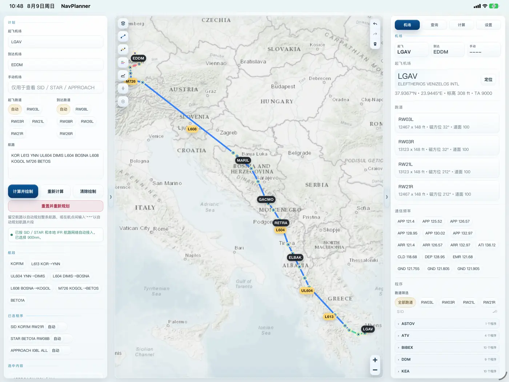</picture></td>
  </tr>
</table>

</details>

#

<details open>
<summary><strong>2 · 查看机场和 Procedure</strong></summary>

1. 生成航路后打开 **机场** 页，并切换到 EDDM 到达机场槽位。
2. 选择 `RW08R` 等跑道，再查看筛选后的 Procedure 列表。
3. 点击 **STAR** 标题，在地图中预览全部匹配 STAR；也可点击单个 Procedure 聚焦其路径。
4. 同时检查跑道资料、通信频率和完整程序几何。

<table align="center" width="92%">
  <tr>
    <th align="center">iPhone</th>
    <th align="center">iPad/macOS</th>
  </tr>
  <tr>
    <td align="center"><picture><source media="(prefers-color-scheme: dark)" srcset="Media/workflows/zh-Hans/night/02-procedure-iphone.webp" /><source media="(prefers-color-scheme: light)" srcset="Media/workflows/zh-Hans/day/02-procedure-iphone.webp" /></picture></td>
    <td align="center"><picture><source media="(prefers-color-scheme: dark)" srcset="Media/workflows/zh-Hans/night/02-procedure-ipad.webp" /><source media="(prefers-color-scheme: light)" srcset="Media/workflows/zh-Hans/day/02-procedure-ipad.webp" /></picture></td>
  </tr>
</table>

</details>

#

<details open>
<summary><strong>3 · 计算飞行剖面与燃油</strong></summary>

1. 先在 **计划** 页生成航路，并按需选择 `SID`、`STAR` 或 `APPROACH`。
2. 打开 **计算** 页，选择飞机公司和具体机型，再调整 ZFW、携带燃油、巡航高度、巡航 Mach、下降率、气象数据源、重量单位和 QNH 单位。
3. 查看 SimBrief 风格航路剖面，其中包含相对航向风、云、雨、地形、Procedure 高度限制、QNH、缩放和平移控制。
4. 检查地速 / 垂直速度剖面和燃油估算。

当前计算模型本地优先、可离线运行。在线天气仅作为增强，不可用时会降级为本地估算；Terrarium DEM 瓦片可用时用于地形采样，不可用时降级为保守的本地地形估算。直接气象数据授权、离线 DEM 数据包和更完整的机型性能库仍是后续增强方向。

<table align="center" width="92%">
  <tr>
    <th align="center">iPhone</th>
    <th align="center">iPad/macOS</th>
  </tr>
  <tr>
    <td align="center"><picture><source media="(prefers-color-scheme: dark)" srcset="Media/workflows/zh-Hans/night/03-calculate-iphone.webp" /><source media="(prefers-color-scheme: light)" srcset="Media/workflows/zh-Hans/day/03-calculate-iphone.webp" />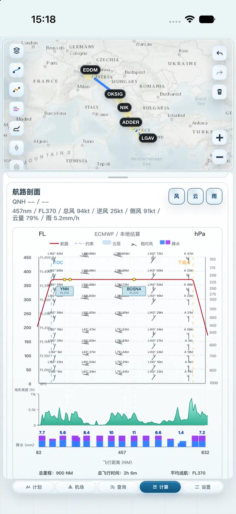</picture></td>
    <td align="center"><picture><source media="(prefers-color-scheme: dark)" srcset="Media/workflows/zh-Hans/night/03-calculate-ipad.webp" /><source media="(prefers-color-scheme: light)" srcset="Media/workflows/zh-Hans/day/03-calculate-ipad.webp" />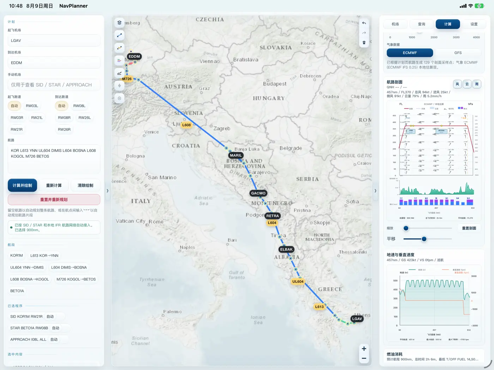</picture></td>
  </tr>
</table>

</details>

#

<details open>
<summary><strong>4 · FR24 轨迹：查询、下载、回放、拟合</strong></summary>

1. 在计划页填写起飞机场和到达机场，再打开 **查询** 页。
2. 直接查询该航线最近最多 10 个航班，或手动搜索航班号 / flightId。Apple 与 Local Web 都会先通过同一 FR24 后端在后台尝试，无需填写官方 API。
3. 只有 FR24 实际要求验证时，才手动打开 **FR24 验证页**并正常完成 FR24 / Cloudflare 验证。Apple 与 macOS Local Web 使用 App 自有 WebKit 会话，不启动 Edge、Chrome 或用户默认浏览器；Windows/Linux Local Web 才从实际环境选择私有 Chrome/Chromium/Edge 会话。Local Web 随后自动同步并关闭验证页；schedule、history 和 playback 继续由共享 Swift 后端处理，不再创建浏览器数据页。
4. 下载并绘制轨迹、导入 GPX 或账户授权导出的 FR24 CSV/KML、查看高度 / 速度剖面，或把当前轨迹拟合到本地航路引擎。

尚未起飞的航班会使用深灰色计划卡片显示。由于 FR24 此时还没有实际 playback，SimNav Studio 会明确提示这一限制，并可使用本地自动规划器以虚线绘制计划预览；该虚线不会被表述为实际飞行轨迹或 FR24 filed route。

若已加载航班的实际起降机场与计划页不同，Query 会在拟合前把实际机场同步回 Plan。对于终端采样充分、跑道判断可靠的轨迹，系统会先匹配完整的 SID / STAR / Approach，再以 Procedure 边界为端点拟合中间航路。

下载轨迹会以 GPX、playback JSON 和 metadata 缓存在本机。Query 可检索缓存、绘制或拟合缓存轨迹、分享 GPX、收藏重要轨迹、打开缓存目录，并清理未收藏的下载记录。

> **在线增强功能。** FR24 为可选功能。Local Web 的私有验证会话和同步后的 FR24 状态只保存在独立数据根中，不读取用户的普通浏览器配置；启动、schedule、history 和 playback 都由共享 Swift FR24 后端处理，不创建浏览器数据页。只有用户手动点击**打开 FR24 验证页**时才显示窗口，验证会话被后端接受后自动关闭。macOS 的窗口由 App 自有 WebKit 承载；Windows/Linux Chromium fallback 的 DevTools 仅监听随机的私有回环端口。网络、会话或验证失败都不会阻断本地航路规划、机场查询、Procedure、nav-overlay 和离线地图。SimNav Studio 不绕过 Cloudflare，也不自动处理 CAPTCHA。

<table align="center" width="92%">
  <tr>
    <th align="center">iPhone</th>
    <th align="center">iPad/macOS</th>
  </tr>
  <tr>
    <td align="center"><picture><source media="(prefers-color-scheme: dark)" srcset="Media/workflows/zh-Hans/night/04-fr24-iphone.webp" /><source media="(prefers-color-scheme: light)" srcset="Media/workflows/zh-Hans/day/04-fr24-iphone.webp" /></picture></td>
    <td align="center"><picture><source media="(prefers-color-scheme: dark)" srcset="Media/workflows/zh-Hans/night/04-fr24-ipad.webp" /><source media="(prefers-color-scheme: light)" srcset="Media/workflows/zh-Hans/day/04-fr24-ipad.webp" />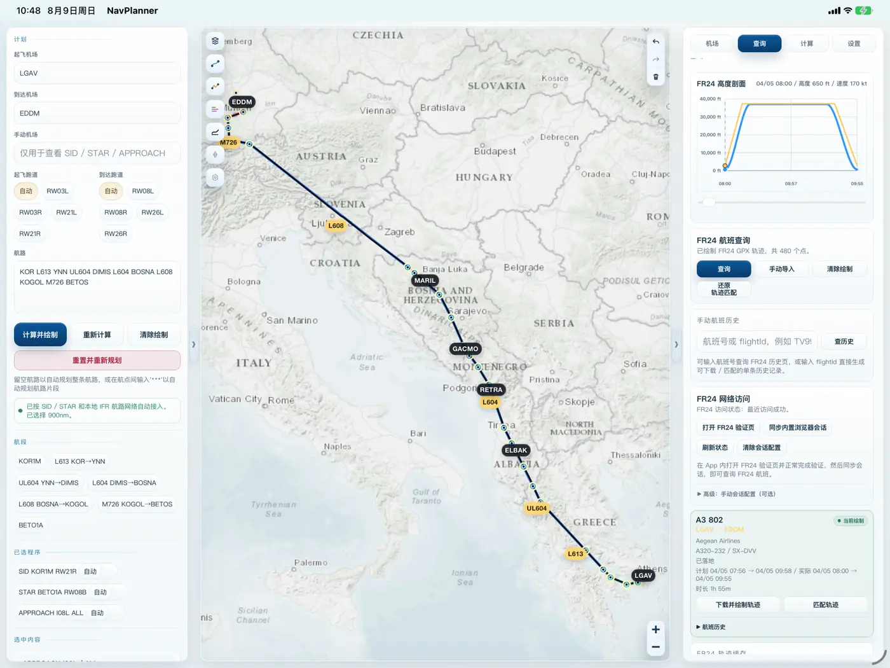</picture></td>
  </tr>
</table>

</details>

#

<details open>
<summary><strong>5 · 管理离线地图和导航数据库</strong></summary>

**离线地图**

1. 打开 **设置** → **管理离线地图**。
2. 导入或下载 PMTiles、MBTiles 或 SQLite 瓦片资源。
3. 选择活动资源后，地图底图会优先使用本地瓦片。

在线地图缓存和离线地图包分开管理。清理在线缓存不会删除导入的地图包或导航数据库。

**导航数据库**

1. 在 **设置** → **导航数据库** 中点击 **选择 s3db**。
2. 从 Files 中选择 `.s3db`、`.sqlite`、`.sqlite3` 或 `.db` 文件，格式须符合 [导入自定义导航数据库兼容格式](#nav-db-compatible-format) 部分所述。
3. SimNav Studio 切换到导入的数据库，并刷新航路、Procedure 和 nav-overlay 缓存。

**外观与 UI 缩放**

1. 打开 **设置** → **外观**，可跟随系统主题或选择日间/夜间模式。
2. **暗色模式地图**默认关闭，因此暗色 UI 会继续使用与亮色 UI 完全相同的地图来源和配色。开启后只请求地图供应商提供的原生暗色瓦片，不叠加深色遮罩或颜色滤镜；当前来源不支持时会自动切换到 ArcGIS World Dark Gray。
3. UI 缩放提供 `-1`、`0`、`+1`、`+2`，默认等级为 `0`，每档以当前设备布局为基准相差 8%；Local Web 的等级 `0` / `100%` 采用原等级 0 大小的 92%（浏览器有效缩放为 82.8%），不改变 Apple 平台既有的等级 0 基准。
4. 文字、控件、面板与地图界面会一起缩放，不改变地图的地理缩放级别；Apple App 与 Local Web 执行同一份 UI 源码，同时保留各自的平台基准。
5. 全新安装默认使用图标风格 2 的“日间 / 默认”版本；设置中仍可选择三种风格各自的日间/夜间高饱和、默认和柔和版本。

<a id="nav-db-compatible-format"></a>
<details>
<summary><strong>导入自定义导航数据库兼容格式</strong></summary>


建议直接使用 PMDG 机型导航数据库 `e_dfd_PMDG.s3db`，或在其基础上自定义。

文件扩展名只用于文件选择器筛选；导入内容必须是有效的 **SQLite 3** 数据库，且采用 SimNav Studio 实际查询的 PMDG 风格导航数据库结构。App 会先把导入文件复制进自身
沙盒，再以只读方式打开该副本；不会转换 CSV、JSON、ARINC 424 原始文本、加密库
或任意自定义 SQLite 结构。

若要完整兼容航路规划、机场详情、Procedure 与导航图层，需保留下列数据表及其
现有 PMDG 字段名：

| 数据范围 | 必需表与主要字段 |
|---|---|
| 周期元数据 | `tbl_header`（`current_airac`、`revision`；一行 header） |
| 机场 | `tbl_airports`（`airport_identifier`、`iata_ata_designator`、`airport_name`、`airport_ref_latitude`、`airport_ref_longitude`） |
| 跑道与通讯 | `tbl_runways`（机场/跑道标识、入口坐标、方位与尺寸），`tbl_airport_communication`（机场标识、类型、频率与呼号） |
| 航点与导航台 | `tbl_enroute_waypoints`、`tbl_terminal_waypoints`、`tbl_vhfnavaids`、`tbl_enroute_ndbnavaids`、`tbl_terminal_ndbnavaids`（标识/名称、经纬度及对应表的类型/频率字段） |
| 航路 | `tbl_enroute_airways`（`route_identifier`、`seqno`、航点标识/坐标、方向、航路类型、高度/航向/距离字段） |
| Procedure | `tbl_sids`、`tbl_stars`、`tbl_iaps`（机场/程序/过渡标识、`route_type`、`seqno`、航点坐标、path termination、航向/圆弧、高度/速度及推荐/圆心航点字段） |
| ILS | `tbl_localizers_glideslopes`（机场/跑道/航向台标识、航向台坐标、方位与频率） |

标识符应使用正常的大写 ICAO/PMDG 值；经纬度使用 WGS 84 十进制度；Procedure
和航路的序号必须能按飞行路径顺序排序。方位/航向、跑道尺寸、高度、频率、
route type 与 path terminator 必须保持 PMDG 结构的单位和语义（程序把跑道长度
解释为英尺）。可以增加其他表和索引，但不能重命名程序查询的表或字段。

导入前可先执行以下基础完整性与结构检查：

```bash
sqlite3 -readonly custom.s3db "PRAGMA quick_check;"
sqlite3 -readonly custom.s3db \
  "SELECT current_airac, revision FROM tbl_header LIMIT 1;"
sqlite3 -readonly custom.s3db \
  "SELECT name FROM sqlite_master WHERE type='table' ORDER BY name;"
```

`PRAGMA quick_check` 应返回 `ok`。仅能正常打开、但缺少必需表或字段的数据库，
可能会导入成功，但相关功能会返回空数据。自定义数据库的准确性、合法性以及
导入或再分发权利由使用者自行负责。

</details>

<table align="center" width="92%">
  <tr>
    <th align="center">iPhone</th>
    <th align="center">iPad/macOS</th>
  </tr>
  <tr>
    <td align="center"><picture><source media="(prefers-color-scheme: dark)" srcset="Media/workflows/zh-Hans/night/05-settings-iphone.webp" /><source media="(prefers-color-scheme: light)" srcset="Media/workflows/zh-Hans/day/05-settings-iphone.webp" />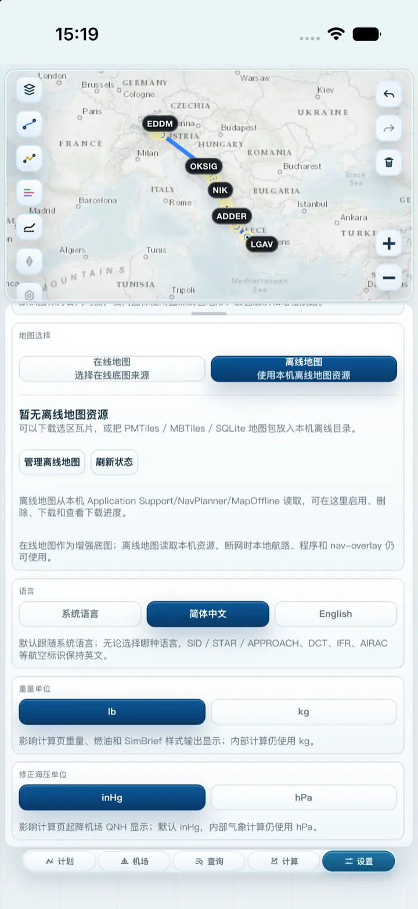</picture></td>
    <td align="center"><picture><source media="(prefers-color-scheme: dark)" srcset="Media/workflows/zh-Hans/night/05-settings-ipad.webp" /><source media="(prefers-color-scheme: light)" srcset="Media/workflows/zh-Hans/day/05-settings-ipad.webp" />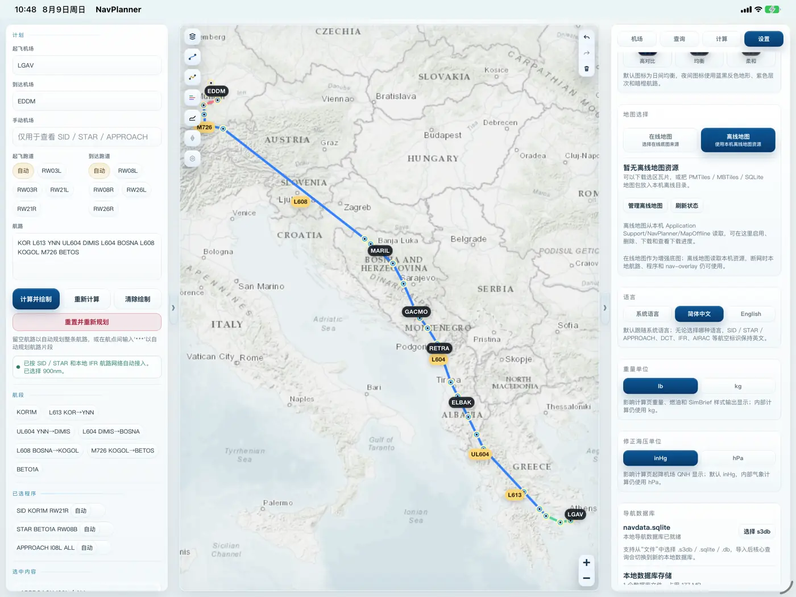</picture></td>
  </tr>
</table>

</details>

<a id="architecture"></a>

## 系统架构 🏗️

架构图以用户可见的核心工作流为主线，而不是从框架分层开始。每个编号步骤按 **功能入口 → 本地 API → 实现原理 → 返回 payload** 展开，同时保留贯穿全流程的运行时与本地数据平面。

<picture>
  <source media="(prefers-color-scheme: dark)" srcset="Media/architecture/project-architecture-zh-dark.webp" />
  <source media="(prefers-color-scheme: light)" srcset="Media/architecture/project-architecture-zh-light.webp" />
  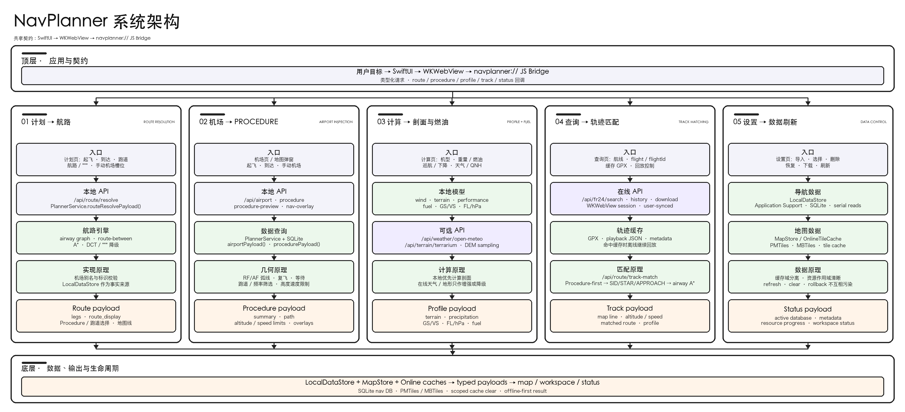
</picture>

编号工作流把依赖方向明确展示出来：航路规划产出的 payload 会被机场、计算和查询复用；Procedure 选择同时约束剖面计算和轨迹拟合；设置页提供所有离线路径依赖的本地数据库与地图存储。箭头同时表达以下实现原理：

| 原理 | 实现边界 | 结果 |
|---|---|---|
| **核心本地优先** | `PlannerService` + `LocalDataStore` + `MapStore` | 航路解析、Procedure、nav-overlay、本地地图和数据库查看在断网时继续工作。 |
| **Procedure-first 拟合** | 实际机场同步 → 终端 Procedure 拟合 → airway A* → 平滑 | 真实轨迹先保留 SID / STAR / APPROACH 语义，再匹配中间航路。 |
| **在线仅作增强** | FR24 会话、Open-Meteo、Terrarium DEM 使用虚线可选路径 | 网络或会话失败时降级到本地估算，不替代核心工作流。 |
| **类型化 payload 边界** | `navplanner://` 与 localhost HTTP adapter 后的共享 `SimNavRuntimeRouter` | 每一步通过 WebKit 或 HTTP 返回同一类 payload，不泄漏存储内部实现。 |
| **缓存域分离** | SQLite 导航库、离线地图包、在线瓦片缓存、FR24 缓存 | 导入、刷新、清理和回滚只作用于各自负责的资源。 |

<a id="build-from-source"></a>

## 从源码构建 🛠️

### 环境要求

- Apple App：macOS 与 Xcode、iOS 17.0 及以上部署目标，以及 iPhone / iPad Simulator、Mac Catalyst 或真机目标
- Local Web 源码运行：macOS 14 及以上、Swift 6.1 及以上和 `curl`
- Local Web 发布包：macOS 使用随包原生 server；Windows 在包含经 Windows smoke 的原生 bundle 时直接运行 SwiftNIO `.exe` 与 Swift/SQLite DLL，否则使用 Docker Desktop；Linux 需要 Docker Engine 与 Compose v2
- 私有 App 或 Local Web 构建可选用本地导航数据库

### 快速开始

```bash
git clone https://github.com/MDX-Tom/simnav-studio.git
cd simnav-studio
Tools/Signing/setup_local_signing.sh
open NavPlanner.xcodeproj
```

签名脚本会从本机有效的 Apple Development 证书读取 Team ID，并且只写入
被 Git 忽略的 `Config/CodeSigning.local.xcconfig`。如果自己的账号无法注册
仓库公开 Bundle Identifier，可传入仅限本机的覆盖值，例如
`--bundle-id com.example.simnavstudio`。Simulator 构建不需要签名；真机运行前，
如果脚本提示没有有效 identity，请先在 Xcode 添加 Apple Account 并创建
Apple Development 证书。
如果 Xcode 后续提示没有可用 profile 或 profile 已过期，请打开
“Xcode → Settings → Accounts”刷新 Apple Account 与证书，再重新运行脚本。
账号凭据始终只留在 Xcode 与钥匙串中，不得复制进仓库。

产品正式名称为 **SimNav Studio**，桌面图标使用短名称 **SimNav**，Bundle
Identifier 为 `com.mdxtom.simnavstudio`。为保持源码兼容，现有
`NavPlanner.xcodeproj`、`NavPlanner` scheme、可执行文件和 App 数据路径名称
保持不变。由于 Bundle Identifier 已更换，Apple 平台会把它视为与旧标识版本
不同的 App，旧 App 沙盒中的数据不会自动迁移。

在 Xcode 中选择 **NavPlanner** scheme，再选择 iPhone、iPad 或 Mac Catalyst
目标并运行。Xcode 会自动读取被忽略的本机配置，不会把 Team ID 写回受跟踪的
工程文件。

Debug 或私有构建可把本地数据库放在
`NavPlanner/Resources/Database/navdata.sqlite`，也可在 App 启动后从 Settings
导入。公开 release 构建不会使用这个开发副本：
`Tools/Release/build_public_release.sh` 要求本机 `database/` 中存在最新的
`e_dfd_PMDG_release.s3db`，完成校验后临时把它作为 IPA 与 DMG 内的
`Database/navdata.sqlite` （请注意，这两个数据库位置均被 Git 忽略）。

### 运行 Local Web

Local Web 开发入口会在 `http://127.0.0.1:8010` 启动原生 server，直接提供 App 的
唯一 Web 资源源，并把选定数据库复制到独立的 Local Web 数据目录：

```bash
Tools/LocalWeb/run.sh
```

在开发 checkout 中，如果被 Git 忽略的
`database/e_dfd_PMDG_release.s3db` 存在，脚本会自动检测；也可以显式指定：

```bash
Tools/LocalWeb/run.sh \
  --database /path/to/navigation.s3db \
  --data-dir /path/to/simnav-web-data \
  --port 8010
```

按 Control-C 停止 server。它只绑定 `127.0.0.1`；Host 与 Origin 只允许 loopback，
会改变状态的请求必须带页面注入的单进程 token。在设置中导入或选择的数据库，会在原生
进程或容器重启后继续保持启用。受跟踪封包工具会生成
`releases/release-<version>/web-bundle/SimNav-Studio-<version>-web.zip`；解压后目录为
`SimNav-Studio-<version>-web/`。Windows 在包含经宿主 smoke 的原生 bundle 时直接
运行 `simnav-local-web.exe` 与 runtime DLL，无需安装 Swift，也不启动 Linux、WSL 或
Docker；原生 bundle 缺失时回退 Docker Desktop。Linux 在固定容器中构建并运行原生 Swift
可执行文件。macOS Local Web 的显式 FR24 验证窗口由 App 自有 WebKit 承载，不启动第三方浏览器；
Windows/Linux 仅在该显式操作中从实际环境选择隔离的 Chrome/Chromium/Edge fallback。Linux
通过仅绑定 Compose 私有网关的 relay 连接，Windows 通过一次性随机 token 的宿主 relay 连接。
验证页自动同步后关闭；普通 Query、历史和 playback 请求直接由共享 Swift 后端处理，无需官方
API 或第二套 FR24 后端。
v0.1.2 候选与 Apple 工件从同一个已审查源码 commit 生成。

浏览器本身并不执行 Swift；各平台启动器会先启动一个只监听回环地址的 HTTP 进程。
Hummingbird 2.22.0 用于 macOS/Linux，但它不支持 Windows，因此 Windows `.exe` 在同一
请求处理器和 `SimNavRuntimeRouter` 上使用薄 SwiftNIO 2.101.3 transport。这是原生
Windows 进程，不是 Linux server。

<details>
<summary><strong>命令行构建</strong></summary>

```bash
xcodebuild -project NavPlanner.xcodeproj \
  -scheme NavPlanner \
  -configuration Debug \
  -destination 'generic/platform=iOS Simulator' \
  -derivedDataPath /private/tmp/NavPlannerDerived \
  build
```

如果 `xcode-select` 指向 Command Line Tools，可显式指定完整 Xcode 开发目录：

```bash
DEVELOPER_DIR=/Applications/Xcode.app/Contents/Developer \
xcodebuild -project NavPlanner.xcodeproj \
  -scheme NavPlanner \
  -configuration Debug \
  -destination 'generic/platform=iOS Simulator' \
  -derivedDataPath /private/tmp/NavPlannerDerived \
  build
```

</details>

### 安装 Releases 中的 iOS、macOS 与 Web

<details>
<summary><strong>查看原因</strong></summary>

GitHub 公开发布的 IPA 必须是用于侧载的未签名包，不得包含维护者证书、
Team ID、provisioning profile、账号邮箱、私钥、App Store Connect 密钥、
xcarchive 或原始构建日志。

本机 Apple Development 配置只能写入已被 Git 忽略的
`Config/CodeSigning.local.xcconfig`。受跟踪的
`Config/CodeSigning.xcconfig` 会可选加载该文件，因此 Xcode GUI 可以在本机
正常签名，而新克隆和公开 unsigned 构建不包含个人身份。没有私有 CI 凭据时，
Mac 工件只做 ad-hoc 签名且不进行 notarization；如未来需要 Developer ID /
App Store 签名，只能在受保护 CI 中从 Secret 临时导入。详见
[公开发布封包说明](Tools/Release/README.md)。

</details>

**安装 iPhone App 需通过 AltStore、SideStore、Sideloadly
或其他可信签名流程，使用自己的账号重新签名。**

<details>
<summary><strong>在 iPhone、iPad、Mac 与 Local Web 上安装</strong></summary>

#### iPhone 与 iPad

GitHub 提供的 IPA 未签名，不包含维护者证书或
provisioning profile，不能直接安装。

1. 下载带 `-unsigned.ipa` 后缀的 IPA 与 `SHA256SUMS.txt`，先复验校验和。release 根目录
   的校验文件严格只列 iOS IPA、macOS DMG 和 Web ZIP 三个工件。
2. 将 IPA 导入 AltStore、SideStore、Sideloadly 或其他可信签名工具。
3. 由工具使用安装者自己的 Apple Account 重新签名并安装。
4. 按工具与设备提示信任本地签名；仅在 iOS/iPadOS 明确要求时启用
   Developer Mode。

此外，也可以直接通过本机 Xcode 安装，先运行
`Tools/Signing/setup_local_signing.sh`，连接设备，在 NavPlanner scheme 中选择
该设备并点击 Run。生成的签名配置只留在当前 Mac，且始终被 Git 忽略。

#### Mac

1. 下载带 `-catalyst-adhoc.dmg` 后缀的 DMG，并复验 SHA-256。
2. 打开 DMG，将其中的 `SimNav-Studio-<version>-catalyst-adhoc.app` 拖入“应用程序”。
3. 首次启动时按住 Control 点击 App 并选择“打开”；如果 macOS 仍拦截，只有在
   已核实校验和与下载来源后，才使用“系统设置 → 隐私与安全性 → 仍要打开”。

当前 Mac 版本是 arm64/x86_64 universal Mac Catalyst App。它只有 ad-hoc
签名且未 notarize，因此不具备 Developer ID/Gatekeeper 公开分发信任；它也不是
原生 AppKit App 或 Designed-for-iPad Wrapper。

#### Local Web

Local Web 是第三个正式 release 平台。完成 Web 集成的 release 会把启动脚本和必要
payload 放在 `web-bundle/SimNav-Studio-<version>-web.zip` 中，解压后目录为
`SimNav-Studio-<version>-web/`：macOS 使用
`run-macos.command`，Linux 使用
`run-linux.sh`，Windows 使用 `run-windows.ps1`。macOS 优先使用 universal 原生
binary；Windows 优先使用随包原生 SwiftNIO `.exe`，只在缺失时使用 Docker；Linux 在
Docker 中以 Hummingbird transport 构建同一个 Swift 核心。Docker 模式的 FR24 专用浏览器
在宿主后台隐藏运行，并通过受限宿主桥连接（Linux 私有 Compose gateway、Windows 鉴权 relay）；
仅手动打开验证页时显示窗口，
FR24 业务仍只在共享 Swift core 实现。所有容器端口都只发布到 `127.0.0.1`；stop 脚本既能处理已记录
的原生进程，也能停止 Docker，并保留 Local Web 数据根 / 命名 volume。ZIP 内的版本化根目录自动携带并
启用与 IPA/DMG 完全同 SHA-256 的 release 导航数据库，但不携带用户地图、轨迹、会话、
缓存或 token；用户仍可从浏览器导入自己有权使用的数据。受跟踪 release builder 与 audit 会在 v0.1.2 候选中生成并校验
该 payload。

</details>

<a id="validation"></a>

## 校验与发布检查 ✅

<details>
<summary><strong>常用本地检查</strong></summary>

```bash
node --check NavPlanner/Resources/Web/app.js
node --check NavPlanner/Resources/Web/runtime.js
node --check NavPlanner/Resources/Web/vendor/maplibre-gl/maplibre-gl.js
plutil -lint NavPlanner.xcodeproj/project.pbxproj NavPlanner/Support/PrivacyInfo.xcprivacy
python3 Tools/Parity/run_all_parity.py
swift test
swift build --product simnav-local-web
Tools/LocalWeb/package_web_release.sh --output /tmp/SimNav-Web-check
Tools/LocalWeb/audit_web_release.sh /tmp/SimNav-Web-check --docker-smoke
```

`Tools/Parity` 会直接编译共享 Swift 核心，并在修改航路规划、轨迹拟合或 Procedure 几何后校验版本化的 Route 22、Track 10 与 Procedure 6 行为 fixture。

</details>

<details>
<summary><strong>发布前检查清单</strong></summary>

- 复核 `PrivacyInfo.xcprivacy` 是否覆盖实际网络、文件、缓存和可选 FR24 行为。
- 用最新 release 数据库替换 `database/e_dfd_PMDG_release.s3db`，检查其 AIRAC、`PRAGMA quick_check`、IPA/DMG 内 SHA-256 一致性及实际兼容性。
- 确认内置示例数据库、用户导入导航数据库、离线地图包和底图来源的授权与分发方式。
- 更新版本号、Build 号、显示名称、签名配置、App 图标和备用图标元数据。
- 在 iPhone 小屏、iPhone 横屏、iPad 竖屏和 iPad 横屏分别测试。
- 验证飞行模式下的启动、机场搜索、机场详情、航路规划、Procedure 绘制、nav-overlay 和离线地图。
- 验证 Apple/macOS Local Web 的 App 自有 WebKit 与 Windows/Linux 私有浏览器 FR24 会话、Cloudflare 处理、航线查询、playback 下载、GPX/CSV/KML 导入、剖面、下载失败、绘制、拟合、分享和缓存流程。
- 验证三套 Web 启动器、随包 Windows 原生 SwiftNIO 工件 smoke、两种 HTTP transport、Docker 回环发布、数据 volume 持久化、IPA/DMG/Web 数据库逐字节一致，以及发布包不含用户数据。
- 构建时保留所有不同版本的 `releases/release-<version>/`。同版本重建只能在新候选通过全部审计后原子替换该版本，不得触碰其他版本。
- 排查 Xcode 日志时优先过滤 `NavPlanner` 进程；beta 模拟器可能输出无关的系统服务错误。

</details>

<a id="project-layout"></a>

## 目录结构 🗂️

```text
NavPlanner.xcodeproj/          Xcode 工程
NavPlanner/
  App/                         SwiftUI App 入口和外壳
  Core/                        共享数据库、规划服务、地图存储、runtime 和 WebBridge
  Features/                    SwiftUI 功能容器
  Resources/Web/               App + Local Web 唯一工作区源
  Support/                     Asset Catalog 与隐私清单
LocalWeb/                      共享 HTTP 处理器、Hummingbird/SwiftNIO adapter 与 SwiftPM 测试
Package.swift                  共享核心与 Local Web 的 SwiftPM 依赖图
Tools/                         Local Web、发布、签名、图标和 parity 工具
Media/                         README 截图与视觉素材
```

<a id="data-notice"></a>

## 数据与安全说明 ⚠️

**SimNav Studio 仅用于模拟飞行规划、数据查看和个人学习。实际飞行必须始终以官方航行资料、管制指令、适航设备和当前运行程序为准。**

SimNav Studio 可能使用第三方或用户自行提供的内容，包括地图底图、机场与 Procedure 数据、AIRAC / 导航数据库、PMTiles / MBTiles / SQLite 地图包，以及 FR24 航班数据。这些内容可能受版权、数据库权利、商标、平台条款或再分发限制约束。

GitHub 公开源码仓库不包含导航数据库：根目录 `database/` 和开发用 bundle 资源均被 Git
忽略。每个本地生成的 release candidate 会把同一份选定示例数据库逐字节放入 IPA、DMG
与 Web，使三个平台首次启动时使用相同示例数据。其随附 notice 要求取得书面再分发许可；
权限确认前，维护者不得公开发布任何包含该数据库的工件。

Local Web 的可写数据库与缓存和 Apple App 完全分离。Web 首次启动会复制并启用随 release
携带的数据库；用户之后仍可通过文档说明的导入或 mount 流程选择自己的兼容数据库。

本 App 不保证第三方数据的准确性、完整性、可用性或法律状态。你需要自行确认拥有每项数据的使用、导入、缓存和分发权利。
