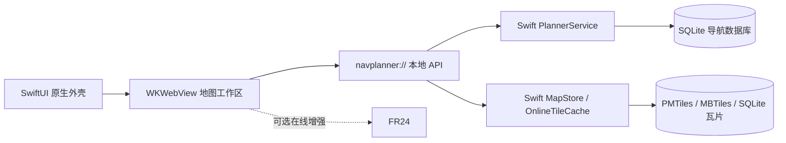

<div align="center">

<picture>
  <source media="(prefers-color-scheme: dark)" srcset="Media/navplanner-hero-dark.webp" />
  <source media="(prefers-color-scheme: light)" srcset="Media/navplanner-hero-light.webp" />
  
</picture><br />

<p>
  <a href="https://github.com/MDX-Tom/NavPlanner-App/stargazers"></a>
  
  
  
  
  
  
</p>

<p>
  <a href="README.md"></a>
  <a href="README.zh-CN.md"></a>
</p>

<h1>NavPlanner</h1>

<p><strong>从航路规划到地图复盘，一站式、本地计算的模拟飞行工作台。</strong></p>
<p>原生适配 iPhone & iPad · 航路规划 · Procedure 查看 · 轨迹对照 · 离线地图</p>

<p>
  <a href="#overview">项目概览</a> ·
  <a href="#highlights">功能亮点</a> ·
  <a href="#showcase">界面展示</a> ·
  <a href="#workflows">核心工作流</a> ·
  <a href="#architecture">系统架构</a> ·
  <a href="#build-from-source">源码构建</a>
</p>

</div>

<!-- README_SYNC: README.md 与 README.zh-CN.md 必须保持结构同步；视觉素材须同时适配亮色与暗色主题。 -->

<a id="overview"></a>

## 项目概览 ✈️

NavPlanner 是一款面向模拟飞行的 iOS 规划工作台。它把 **航路规划**、**机场与 Procedure 查看**、**FR24 轨迹下载、对照与拟合**、**离线地图**、**本地导航数据库**集中在一个 App 中，在核心功能离线可用的基础上，串联从航线构思到地图复盘的完整流程。

App 以 SwiftUI 构建原生外壳，以 WKWebView 承载地图工作区，并在 App 内封装 Swift 服务层。导入的数据库、地图包、缓存、偏好设置和轨迹历史均保存在 App 沙盒内。

<p align="center">
  <strong>航线构思</strong> → <strong>自动规划</strong> → <strong>Procedure 选择</strong> → <strong>飞行剖面计算</strong> → <strong>地图复盘</strong>
</p>

> [!CAUTION]
> **仅限模拟飞行。** NavPlanner 不是认证航空软件，不得用于真实飞行计划、真实导航、签派放行、运行决策或任何安全关键航空活动。

<a id="highlights"></a>

## 功能亮点 ✨

|  | 能力 | 功能说明 |
|:--:|---|---|
| 🧭 | **本地航路规划** | 输入起飞机场、到达机场和航路文本并绘制航路；航路留空时自动规划整条航路，也可在航点间插入 `***` 自动规划片段。 |
| 🛬 | **机场与 Procedure 查看** | 查看跑道、通信频率、`SID`、`STAR`、`APPROACH`，并支持 RF / AF 弧线、复飞段和等待航线几何。 |
| 🗺️ | **多图层地图工作区** | 独立控制底图、各类航路、Procedure、FR24 轨迹、航点、导航台、跑道、ILS 和 airway 标签；支持撤销、重做与清除绘制。 |
| 📐 | **飞行计算工作台** | 配置机型、重量、燃油、巡航、下降、天气和 QNH，查看风速 / 地形、地速 / 垂直速度剖面及 SimBrief 风格燃油估算。 |
| 📡 | **FR24 轨迹对照** | 在同步 App 内浏览器会话后查询近期航班或 flightId，导入 GPX、查看剖面，并把实际轨迹拟合回本地航路数据。 |
| 💾 | **离线地图库** | 导入或下载 PMTiles、MBTiles、SQLite 瓦片库和 Web 旧版 `tiles/` 布局，并与在线地图缓存分开管理。 |
| 🗄️ | **本地导航数据库** | 导入 `.s3db`、`.sqlite`、`.sqlite3` 或 `.db`，切换数据库、删除未使用副本，并恢复内置数据库。 |

<a id="showcase"></a>

## 界面展示 🖥️

<p align="center">
  
  &nbsp;&nbsp;
  
</p>
<p align="center"><sub>自适应 iPad 地图工作区与紧凑型 iPhone 规划流程。</sub></p>

<a id="workflows"></a>

## 核心工作流 🧭

<details open>
<summary><strong>1 · 规划并绘制航路</strong></summary>

1. 打开 **计划** 页。
2. 输入起飞机场和到达机场，例如 `KLAX` 与 `KJFK`。
3. 选择起飞 / 到达跑道，或保持自动选择。
4. 输入航路文本，留空自动规划整条航路，或在两个航点间输入 `***` 自动规划片段。
5. 点击 **生成并绘制航路**。

</details>

<details>
<summary><strong>2 · 查看机场和 Procedure</strong></summary>

1. 在计划页输入手动机场，或点击地图上的机场。
2. 打开 **机场** 页，在起飞、到达、手动机场槽位之间切换。
3. 查看跑道、通信频率和 Procedure 列表。
4. 点击 Procedure 条目，在地图上预览路径。

</details>

<details>
<summary><strong>3 · 计算飞行剖面与燃油</strong></summary>

1. 先在 **计划** 页生成航路，并按需选择 `SID`、`STAR` 或 `APPROACH`。
2. 打开 **计算** 页，选择飞机公司和具体机型，再调整 ZFW、携带燃油、巡航高度、巡航 Mach、下降率、气象数据源、重量单位和 QNH 单位。
3. 查看 SimBrief 风格航路剖面，其中包含相对航向风、云、雨、地形、Procedure 高度限制、QNH、缩放和平移控制。
4. 检查地速 / 垂直速度剖面和燃油估算。

当前计算模型本地优先、可离线运行。在线天气仅作为增强，不可用时会降级为本地估算；Terrarium DEM 瓦片可用时用于地形采样，不可用时降级为保守的本地地形估算。直接气象数据授权、离线 DEM 数据包和更完整的机型性能库仍是后续增强方向。

</details>

<details>
<summary><strong>4 · FR24 轨迹：查询、下载、回放、拟合</strong></summary>

1. 在计划页填写起飞机场和到达机场，再打开 **查询** 页。
2. 首次查询时，在 App 内浏览器打开验证页，完成 FR24 / Cloudflare 验证并同步浏览器会话。
3. 查询该航线最近最多 10 个航班，或手动搜索航班号 / flightId。
4. 下载并绘制轨迹、导入 GPX、查看高度 / 速度剖面，或把轨迹拟合到本地航路引擎。

若已加载航班的实际起降机场与计划页不同，Query 会在拟合前把实际机场同步回 Plan。对于终端采样充分、跑道判断可靠的轨迹，系统会先匹配完整的 SID / STAR / Approach，再以 Procedure 边界为端点拟合中间航路。

下载轨迹会以 GPX、playback JSON 和 metadata 缓存在本机。Query 可检索缓存、绘制或拟合缓存轨迹、分享 GPX、收藏重要轨迹、打开缓存目录，并清理未收藏的下载记录。

> **在线增强功能。** FR24 为可选功能。断网、会话失效或 FR24 返回验证页时，本地航路规划、机场查询、Procedure、nav-overlay 和离线地图仍可使用。NavPlanner 只复用用户在 App 内完成验证后的会话，不绕过 Cloudflare，也不自动处理 CAPTCHA。

</details>

<details>
<summary><strong>5 · 管理离线地图和导航数据库</strong></summary>

**离线地图**

1. 打开 **设置** → **管理离线地图**。
2. 导入或下载 PMTiles、MBTiles 或 SQLite 瓦片资源。
3. 选择活动资源后，地图底图会优先使用本地瓦片。

在线地图缓存和离线地图包分开管理。清理在线缓存不会删除导入的地图包或导航数据库。

**导航数据库**

1. 在 **设置** → **导航数据库** 中点击 **选择 s3db**。
2. 从 Files 中选择 `.s3db`、`.sqlite`、`.sqlite3` 或 `.db` 文件。
3. NavPlanner 切换到导入的数据库，并刷新航路、Procedure 和 nav-overlay 缓存。

</details>

<a id="architecture"></a>

## 系统架构 🏗️



本地服务层是航路规划、Procedure 几何、地图存储和导入数据的事实来源。FR24 与在线天气用于增强工作流，不会取代离线航路规划与数据查看。

<a id="build-from-source"></a>

## 从源码构建 🛠️

### 环境要求

- macOS 与 Xcode
- iOS 17.0 及以上部署目标
- iPhone / iPad Simulator 或真机
- 私有构建可选用本地导航数据库

### 快速开始

```bash
git clone https://github.com/MDX-Tom/NavPlanner-App.git
cd NavPlanner-App
open NavPlanner.xcodeproj
```

在 Xcode 中选择 **NavPlanner** scheme，选择 iPhone 或 iPad 运行目标，为自己的账号配置签名团队和 Bundle Identifier，然后运行 App。

私有构建可把本地数据库放在 `NavPlanner/Resources/Database/navdata.sqlite`，也可在 App 启动后从 Settings 导入。公开分发时，不应包含尚未确认再分发权利的导航数据。

<details>
<summary><strong>命令行构建</strong></summary>

```bash
xcodebuild -project NavPlanner.xcodeproj \
  -scheme NavPlanner \
  -configuration Debug \
  -destination 'generic/platform=iOS Simulator' \
  -derivedDataPath /private/tmp/NavPlannerDerived \
  build
```

如果 `xcode-select` 指向 Command Line Tools，可显式指定完整 Xcode 开发目录：

```bash
DEVELOPER_DIR=/Applications/Xcode.app/Contents/Developer \
xcodebuild -project NavPlanner.xcodeproj \
  -scheme NavPlanner \
  -configuration Debug \
  -destination 'generic/platform=iOS Simulator' \
  -derivedDataPath /private/tmp/NavPlannerDerived \
  build
```

</details>

<a id="validation"></a>

## 校验与发布检查 ✅

<details>
<summary><strong>常用本地检查</strong></summary>

```bash
node --check NavPlanner/Resources/Web/app.js
node --check NavPlanner/Resources/Web/vendor/maplibre-gl/maplibre-gl.js
plutil -lint NavPlanner.xcodeproj/project.pbxproj NavPlanner/Support/PrivacyInfo.xcprivacy
python3 Tools/Parity/run_all_parity.py
```

`Tools/Parity` 用于在修改航路规划、轨迹拟合或 Procedure 几何后，对照 Swift 本地服务层和只读 Web 参考实现。

</details>

<details>
<summary><strong>发布前检查清单</strong></summary>

- 复核 `PrivacyInfo.xcprivacy` 是否覆盖实际网络、文件、缓存和可选 FR24 行为。
- 确认导航数据库、离线地图包和底图来源的授权与分发方式。
- 更新版本号、Build 号、显示名称、签名配置、App 图标和备用图标元数据。
- 在 iPhone 小屏、iPhone 横屏、iPad 竖屏和 iPad 横屏分别测试。
- 验证飞行模式下的启动、机场搜索、机场详情、航路规划、Procedure 绘制、nav-overlay 和离线地图。
- 验证 FR24 会话缺失、Cloudflare 验证、flightId、GPX 导入、剖面滑动、下载失败、轨迹绘制、拟合、分享和缓存管理流程。
- 排查 Xcode 日志时优先过滤 `NavPlanner` 进程；beta 模拟器可能输出无关的系统服务错误。

</details>

<a id="project-layout"></a>

## 目录结构 🗂️

```text
NavPlanner.xcodeproj/          Xcode 工程
NavPlanner/
  App/                         SwiftUI App 入口和外壳
  Core/                        本地数据库、规划服务、地图存储和 WebBridge
  Features/                    SwiftUI 功能容器
  Resources/Web/               WKWebView 地图工作区资源
  Support/                     Asset Catalog 与隐私清单
Tools/                         图标生成和 parity 校验工具
Media/                         README 截图与视觉素材
```

<a id="data-notice"></a>

## 数据与安全说明 ⚠️

NavPlanner 仅用于模拟飞行规划、数据查看和个人学习。实际飞行必须始终以官方航行资料、管制指令、适航设备和当前运行程序为准。

NavPlanner 可能使用第三方或用户自行提供的内容，包括地图底图、机场与 Procedure 数据、AIRAC / 导航数据库、PMTiles / MBTiles / SQLite 地图包，以及 FR24 航班数据。这些内容可能受版权、数据库权利、商标、平台条款或再分发限制约束。

本 App 不保证第三方数据的准确性、完整性、可用性或法律状态。你需要自行确认拥有每项数据的使用、导入、缓存和分发权利。
